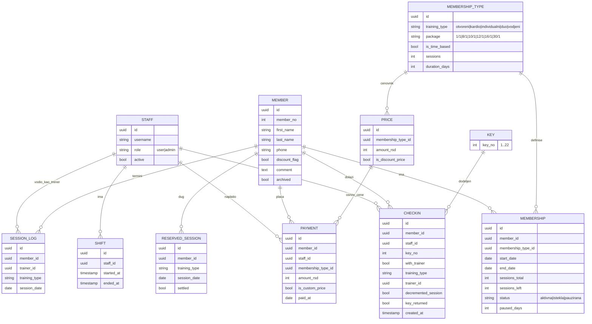
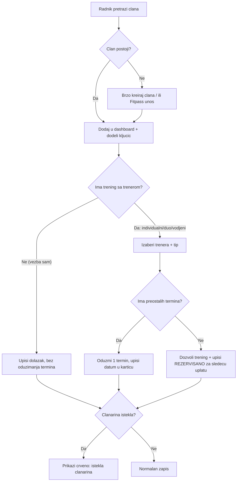
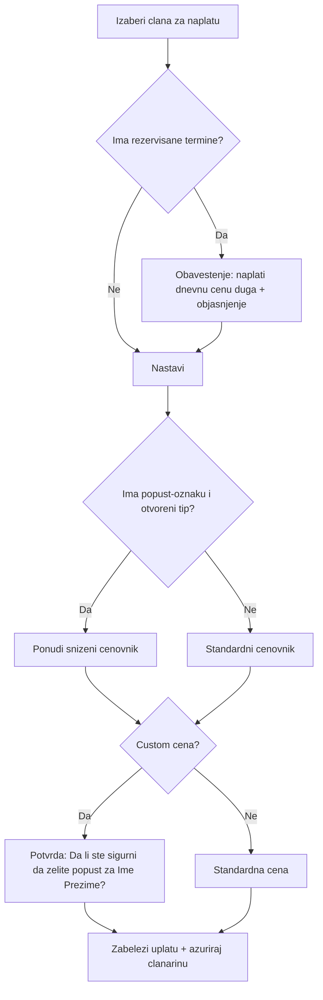

# PRD / SoW — Sistem za upravljanje teretanom

Verzija: 1.0
Datum: 2026-06-11
Status: Nacrt za potvrdu (pre implementacije)

---

## 1. Pregled

Interna web aplikacija za vođenje teretane (porodični biznis) koja zamenjuje papirnu evidenciju. Radnici za pultom svakodnevno upisuju dolaske članova, beleže ključiće, evidentiraju keš uplate i upravljaju članstvima. Sistem mora biti brz za rad na jednom pultu i otporan na kratke prekide interneta.

### 1.1 Ciljevi
- Brz dnevni upis dolazaka članova (ime, prezime, redni broj, ključić, status članarine).
- Jednostavna evidencija keš uplata sa dnevnim/mesečnim/godišnjim zbirom.
- Jasna virtuelna kartica svakog člana sa svim podacima i istorijom.
- Lako kreiranje novih članova i upravljanje članarinama (više tipova i cenovnika).
- Vidljivost isteklih i uskoro isteklih članarina.
- Evidencija smena radnika radi odgovornosti.
- Rad i tokom kratkih prekida interneta (offline-first za upis i naplatu).

### 1.2 Tehnološki stack
- Frontend/Backend: **Next.js 15** (App Router), **React 19**.
- UI: **shadcn/ui** + **Tailwind CSS v4** (pravilo projekta: uvek koristiti shadcn primitive preko MCP-a).
- Baza i Auth: **Supabase** (Postgres + Supabase Auth). Postojeći helperi: [utils/supabase/server.ts](utils/supabase/server.ts), [utils/supabase/client.ts](utils/supabase/client.ts), [utils/supabase/middleware.ts](utils/supabase/middleware.ts).
- Email (instaliran, opciono za kasnije): **Resend** ([utils/resend/send.ts](utils/resend/send.ts)). U v1 obaveštenja su samo vizuelna.
- Hosting: **Vercel + Supabase**, aplikacija kao **PWA** sa lokalnim kešom i sinhronizacijom.
- Lokalizacija: **srpski (latinica)**, jedini jezik.
- Vremenska zona: **Europe/Belgrade**; dan se resetuje u **ponoć** lokalnog vremena.

---

## 2. Korisničke role i dozvole

| Mogućnost | User (pult) | Admin |
|---|---|---|
| Login/logout | Da | Da |
| Upis dolazaka, dodela/oslobađanje ključa | Da | Da |
| Naplata (keš) i custom cena uz potvrdu | Da | Da |
| Kreiranje/izmena/arhiviranje članova i njihovih podataka | Da (svi članovi, bilo kad) | Da |
| Izmena dnevnih logova (dolasci/uplate) | Samo za **današnji** dan | Bilo koji dan |
| Pregled pazara | Samo **dnevni** (danas i unazad) | **Dnevni, mesečni, godišnji** |
| Pregled smena (ko je radio i do kada) | Ne | Da |
| Upravljanje nalozima radnika (kreiranje/gašenje/reset lozinke) | Ne | Da |

Napomene:
- Postoji **minimum 2 Admina**; samo Admini upravljaju nalozima radnika.
- Prijava je preko **korisničkog imena + lozinke** (bez email-a). Tehnički se realizuje preko Supabase Auth uz interni (sintetički) email mapiran na korisničko ime, tako da role/audit i dalje rade.
- Smene se izvode **automatski iz login sesija** (ko je bio prijavljen i u kom periodu).

---

## 3. Funkcionalni zahtevi

### 3.1 Login
- Stranica za prijavu (korisničko ime + lozinka).
- Nakon prijave: redirekt na glavni Dashboard.
- Bočni meni (sidebar) sa navigacijom: Dashboard, Članovi, Cene članarina, Dnevne uplate (pazar), (Admin: Smene, Nalozi).

### 3.2 Glavni Dashboard (dnevni upis)
- Prikaz svih dolazaka za izabrani dan: **ime, prezime, redni broj, broj ključića**.
- Ako je članarina istekla pri upisu — pored zapisa crveno **"istekla članarina"** (upis se ipak dozvoljava).
- Ako član tog dana plati — pored zapisa stoji **koju članarinu je uplatio i koliko** je platio.
- **Pretraga člana** pri upisu: po imenu, prezimenu, rednom broju i telefonu.
- **Više dolazaka istog člana** u istom danu je dozvoljeno (svaki dolazak je zaseban zapis).
- Pri upisu, ako član ima tip članstva sa trenerom, radnik može da **štiklira tip treninga**: "vođeni", "individualni" ili "duo":
  - Ako je štikliran tip treninga sa trenerom → upisuje se dolazak, **oduzima se 1 termin**, i datum termina se **upisuje u karticu člana**. Bira se i **trener** (sa liste User naloga).
  - Ako nije štiklirano (član vežba sam) → upisuje se dolazak, **termin se ne oduzima** (član sa paketom treninga ili mesečnom članarinom sme da vežba sam).
- **Komentar/posebne potrebe**: ako član ima komentar, vidi se i u redu dashboarda (oznaka) i na kartici; pri upisu/naplati takvog člana **iskače poruka** tipa "ovaj član možda plaća manje — pogledaj komentar zašto".
- Dugme **"otišao"** pored zapisa: oslobađa ključić za ponovnu dodelu.
- **Navigacija unazad kroz dane** (pregled prethodnih dana).

### 3.3 Članovi i virtuelna kartica
Polja kartice:
- Redni broj (automatski rastući, trajan, bez ponovne upotrebe).
- Ime, Prezime.
- Broj telefona (**obavezan i jedinstven**).
- Trenutna članarina: tip, datum uplate, datum početka, datum isteka, broj preostalih termina (ako je paket), status (aktivna / istekla / pauzirana / bez članarine).
- Oznaka popusta (porodica/škola) — da/ne.
- Custom (prilagođena) cena — ako postoji.
- Komentar (posebne potrebe).
- **Istorija**: prethodne članarine, istorija uplata, istorija termina (datumi treninga sa trenerom), rezervisani/dugovani termini.

Pravila:
- Član se **može kreirati bez članarine** (status "bez članarine").
- Brisanje je **meko (arhiviranje)** — član nestaje iz aktivnih lista, ali istorija ostaje.
- Redni broj se **ne koristi ponovo** ni nakon arhiviranja.

### 3.4 Članarine — model i pravila
Tipovi treninga:
- Otvoreni tip (samostalno vežbanje)
- Kardio (samo kardio sprave)
- Individualni treninzi (1 na 1 sa trenerom)
- Duo treninzi (2 člana + 1 trener, cena **po vežbaču**)
- Vođeni (grupni) treninzi

Dve vrste obračuna:
- **Vremenske (bez termina)** — neograničeni dolasci dok traje period; samo se proverava istek:
  - Otvoreni tip 30/1, Otvoreni tip popust 30/1, Kardio 30/1.
- **Po terminima** — paket od N termina, važi **30 dana od datuma početka**; neiskorišćeni termini propadaju (uz mogućnost dozvole, vidi dole):
  - Svi individualni/duo/vođeni paketi, dnevni (1/1) i otvoreni tip 8/1 i 12/1.

Pravila:
- **Jedna aktivna članarina po članu** u datom trenutku (nema paralelnih).
- **Početak članarine**: podrazumevano od datuma uplate; radnik može da postavi da počinje **od prvog dolaska** (npr. član plati a krene za 5 dana).
- **Oduzimanje termina**:
  - Trening sa trenerom (individualni/duo/vođeni) → 1 termin po članu po terminu (kod duo i grupnog svakom prisutnom članu se skida 1 i upisuje u njegovu karticu).
  - Otvoreni tip po terminima (8/1, 12/1, dnevni) → svaki dolazak skida 1 termin.
  - Vremenske članarine → ništa se ne oduzima, samo dolazak ostaje u istoriji.
- **Korišćenje preostalih termina posle isteka**: dozvoljeno uz dozvolu (override).
- **Pauziranje (odmor)**: dugme **"Pauziraj članarinu"** zamrzava članarinu; **"Nastavi članarinu"** je vraća odakle je stala (produžava rok za trajanje pauze).
- **Obnova/produženje**: kreira se **novi period** članarine; na kartici se vidi trenutni period + istorija ranijih.

### 3.5 Trening sa 0 termina — rezervisani (dugovani) termin
- Ako član dođe na trening sa trenerom a ima 0 termina (ili nema aktivan paket), **trening se dozvoljava**.
- Na karticu se upisuje **datum termina kao "rezervisano"** (dug), **bez pretpostavke** koji će tip članarine sledeći kupiti.
- Pri **sledećoj uplati** taj dug se naplaćuje kao **dnevna cena tog tipa treninga** (individualni/duo/vođeni), dodatno na izabranu članarinu.
- Iskače **obaveštenje** objašnjenja, npr.: "Dana {datum} {Ime Prezime} bio je na {individualni/vođeni/duo} treningu i nije platio taj dodatni termin — naplatiti {dnevna cena}."
- Može postojati **više rezervisanih datuma** ako član dođe više puta pre nego što plati; sistem **upozorava posle 3 dugovana termina**.

### 3.6 Naplata (keš)
- Samo gotovina (nema kartica).
- Uplata može biti **samostalna** (član plati, ne mora taj dan da trenira) **ili vezana za dolazak** — radnik bira.
- Pri naplati se evidentira: član, tip članarine, iznos, datum.
- **Custom (prilagođena) cena**: svaki radnik (User) može uneti nižu cenu, uz **potvrdu**: "Da li ste sigurni da želite popust za {Ime Prezime}?".
- **Popust (porodica/škola)**: član se označi kao "popust"; pri izboru **otvorenog tipa** automatski mu se nude **sniženi cenovnici** (12/1 = 2500, 30/1 = 2700). Popust važi **samo za otvoreni tip**.

### 3.7 Ključevi (22 komada)
- Pri upisu se dodeljuje **broj ključića** (od 1 do 22).
- Dashboard prikazuje **zauzetost** (koji su trenutno dodeljeni).
- Dugme **"otišao"** oslobađa ključić za ponovnu dodelu.
- Na kraju dana, ako neki ključić nije oslobođen → znak da ga je neko odneo.
- **Pretraga ključa**: uneseš broj ključa → sistem nalazi **poslednjeg člana koji je imao taj ključ** → prikaže rezultat (da znamo koga da kontaktiramo).

### 3.8 Fitpass
- **Brz anonimni unos** "Fitpass" u dashboard + obavezno **broj ključića** (bez kreiranja kartice člana).
- Za grupni trening preko Fitpass-a ide **doplata 300 din**, koja se **beleži kao uplata** tog dana i **ulazi u dnevni zbir**.

### 3.9 Cene članarina (stranica)
- Pregledna stranica: **izabereš tip članarine → prikažu se sve cene za taj tip**.
- **Admin može menjati cene** kroz aplikaciju; izmenjene cene se odmah koriste pri naplati. (Bez čuvanja istorije starih cena u v1.)

### 3.10 Dnevne uplate / Pazar
- Stranica sa svim uplatama izabranog dana i **ukupnim zbirom na dnu**.
- **Navigacija unazad kroz dane**.
- **User** vidi samo dnevni pazar (danas i unazad).
- **Admin** vidi dnevni, **mesečni i godišnji** pazar.

### 3.11 Smene i revizija
- Smene se beleže **automatski iz login/logout sesija** (ko je bio prijavljen i u kom periodu).
- Admin vidi ko je radio, do kada, i kada je došla druga smena.

### 3.12 Obaveštenja o isteku
- **Samo vizuelno** u aplikaciji (v1): crveno "istekla članarina" na dashboardu + lista **"uskoro ističe"** za članove kojima ističe za **≤ 3 dana**.

### 3.13 Offline rad (PWA)
- Internet je uglavnom stabilan, ali povremeno pada.
- Offline moraju da rade: **dnevni upis dolazaka (check-in)** i **naplata**.
- Po povratku interneta podaci se **sinhronizuju** sa Supabase.
- Kreiranje novih članova/izmene mogu da čekaju net (van obaveznog offline opsega).

### 3.14 Bekap
- **Automatski izvoz na lokalni USB 3x dnevno** (računar na pultu mora biti uključen).
- Podaci ostaju i u Supabase cloud-u (dodatni sloj sigurnosti).
- Obim baze je mali (do ~1000 članova), pa su izvozi brzi.

---

## 4. Cenovnik (RSD)

### Individualni treninzi
- 1/1 (dnevna): 1.200
- 8/1: 8.800
- 10/1: 9.800
- 12/1: 11.800

### Duo treninzi (po vežbaču)
- 1/1 (dnevna): 1.000
- 8/1: 6.800
- 10/1: 7.800
- 12/1: 8.800

### Vođeni (grupni) treninzi
- 8/1: 3.600
- 10/1: 4.100
- 12/1: 4.600
- 16/1: 5.100

### Samostalno vežbanje (otvoreni tip)
- 1/1 (dnevna): 450
- 8/1: 2.600
- 12/1: 2.800
- 30/1: 3.200

### Kardio
- 30/1: 2.600

### Popust (porodica: majka-ćerka, sestre; osnovna/srednja škola) — samo otvoreni tip
- 12/1: 2.500
- 30/1: 2.700

### Fitpass
- Doplata za grupni trening: +300 (uz obavezan upis ključića).

> Napomena: oznaka "N/1" znači N termina sa rokom od 1 meseca (30 dana), osim "30/1" koji je vremenska mesečna članarina (neograničeni dolasci).

---

## 5. Podatkovni model (skica)

> Napomena: Fitpass dolasci se beleže anonimno (bez `member_id`), kao poseban tip zapisa u CHECKIN/PAYMENT sa oznakom Fitpass i obaveznim `key_no`.

---

## 6. Ključni tokovi

### 6.1 Dolazak člana (check-in)

### 6.2 Naplata sa dugom i popustom

---

## 7. Nefunkcionalni zahtevi
- **Performanse**: upis dolaska treba da bude par sekundi; pretraga člana brza (do ~1000 članova).
- **Pouzdanost/offline**: PWA sa lokalnim kešom za check-in i naplatu; sinhronizacija po povratku neta; sprečiti gubitak unosa.
- **Bezbednost**: role (User/Admin), Supabase RLS politike po roli; samo Admini upravljaju nalozima.
- **Revizija**: svaki zapis nosi ko ga je uneo; izmene starih dana samo Admin.
- **Lokalizacija**: srpski latinica; valuta RSD; vreme Europe/Belgrade.
- **Uređaj**: optimizovano za jedan pult (desktop/tablet), responsivno.

---

## 8. Potvrđene odluke i preostale pretpostavke

Potvrđeno:
1. **Više rezervisanih termina**: dozvoljeno je akumulirati više dugovanih datuma, uz **upozorenje posle 3 dugovana termina**.
2. **Resend (email)**: instaliran, ali se u v1 **NE koristi** — obaveštenja su samo vizuelna.
3. **Cene — istorija**: u v1 se **ne čuva** istorija starih cena (samo trenutne).

Preostale radne pretpostavke (nisu eksplicitno potvrđene; lako se koriguju u implementaciji):
4. **Vidljivost duga**: rezervisani termini se vide na kartici člana + oznaka u dashboardu + podsetnik pri sledećoj naplati.
5. **Okidač popup poruke o nižoj ceni**: javlja se kada član ima custom cenu ILI popust-oznaku, pri naplati (i kada se otvori kartica sa komentarom).
6. **Login bez email-a**: realizacija preko Supabase Auth sa internim sintetičkim email-om mapiranim na korisničko ime.
7. **Jedna lokacija**: sistem je za jednu teretanu (bez multi-lokacije).

---

## 9. Obim posla (SoW) — predložene faze

### Faza 0 — Postavka
- Supabase šema (tabele iz sekcije 5) + RLS politike po roli.
- Auth (korisničko ime + lozinka), seed 2 Admina.
- Osnovni layout: sidebar navigacija, shadcn/ui tema.

### Faza 1 — Jezgro (MVP)
- Članovi: kreiranje, izmena, arhiviranje, virtuelna kartica, pretraga.
- Članarine: tipovi, cenovnik, dodela, model termina/vremenski, početak od uplate/prvog dolaska.
- Dashboard: dnevni upis, ključići (22) + "otišao", status istekle članarine, navigacija po danima.
- Naplata: keš, custom cena (potvrda), popust-cenovnik, dnevni pazar + zbir.

### Faza 2 — Napredne radne funkcije
- Trening sa trenerom (štikliranje tipa, izbor trenera, oduzimanje termina, upis u karticu).
- Rezervisani/dugovani termini + naplata duga po dnevnoj ceni + obaveštenja.
- Pauziranje/nastavak članarine.
- Fitpass brzi unos + doplata 300 u pazar.
- Pretraga ključa (poslednji vlasnik).
- Smene iz login sesija + Admin pregled.
- Mesečni i godišnji pazar (Admin).
- Lista "uskoro ističe (≤3 dana)".

### Faza 3 — Pouzdanost
- PWA + offline check-in/naplata + sinhronizacija.
- Automatski izvoz bekapa na USB 3x dnevno.

### Van obima (v1)
- Email/SMS obaveštenja članovima.
- Izveštaj učinka trenera (zarada).
- Multi-lokacija.
- Uvoz postojećih članova (kreće se od nule).
- Plaćanje karticom.
- Fotografije članova i dodatna polja (datum rođenja, adresa, hitni kontakt).

---

## 10. Rezime usvojenih odluka (sa intervjua)
- Prijava: korisničko ime + lozinka; min. 2 Admina upravljaju nalozima.
- Jedan uređaj na pultu; srpski latinica; Europe/Belgrade, reset u ponoć.
- Treneri = User nalozi, biraju se sa liste.
- Jedna aktivna članarina po članu; početak od uplate ili prvog dolaska.
- Termini važe 30 dana; neiskorišćeni propadaju (uz dozvolu mogu i posle isteka).
- Pauziranje/nastavak članarine dugmetom.
- 22 ključa, prikaz zauzetosti, "otišao" oslobađa, pretraga po broju ključa.
- Custom cena uz potvrdu; porodični/đački popust samo za otvoreni tip (auto sniženi cenovnik).
- Fitpass anonimno + ključić; grupni Fitpass +300 ulazi u pazar.
- Više dolazaka istog člana dnevno; samostalni dolazak se loguje bez oduzimanja termina.
- Trening sa trenerom: štikliraj tip (individualni/duo/vođeni) → oduzmi termin + upiši datum u karticu.
- 0 termina: dozvoli trening, upiši "rezervisano" (upozorenje posle 3), naplati dnevnu cenu pri sledećoj uplati uz obaveštenje.
- Meko brisanje članova; redni broj trajan i bez ponovne upotrebe.
- User menja sve članske podatke, ali dnevne logove samo za danas; Admin sve dane.
- Pazar: User dnevni; Admin dnevni/mesečni/godišnji.
- Obaveštenja samo vizuelna; "uskoro ističe" prag 3 dana.
- Bekap: automatski USB 3x dnevno + Supabase cloud.
- Hosting: Vercel + Supabase, PWA sa offline check-in/naplatom.
