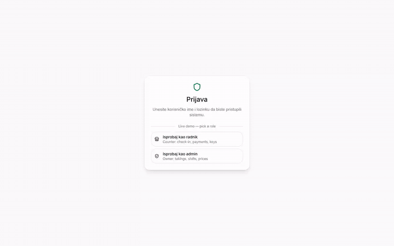
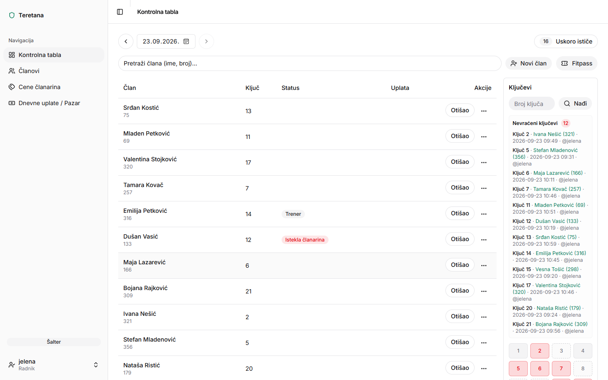
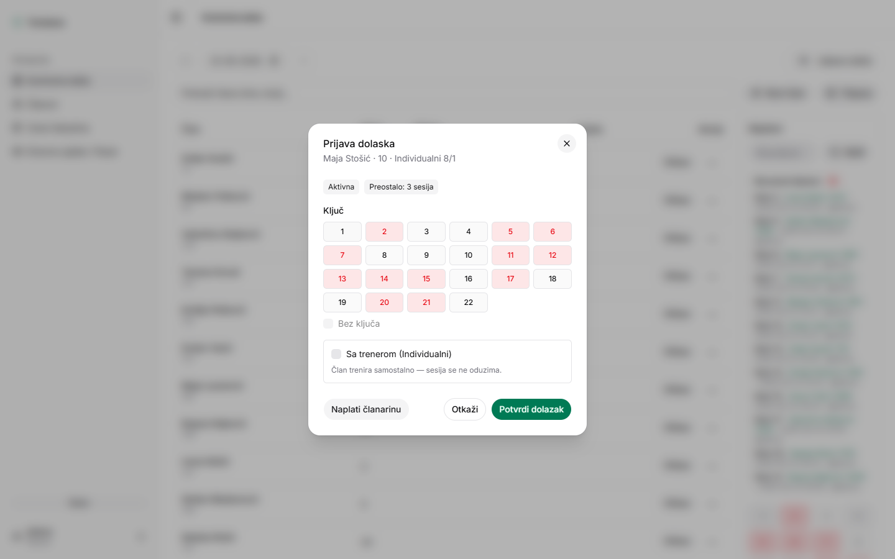
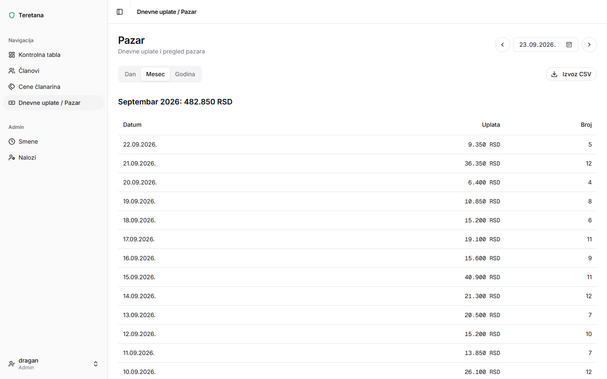
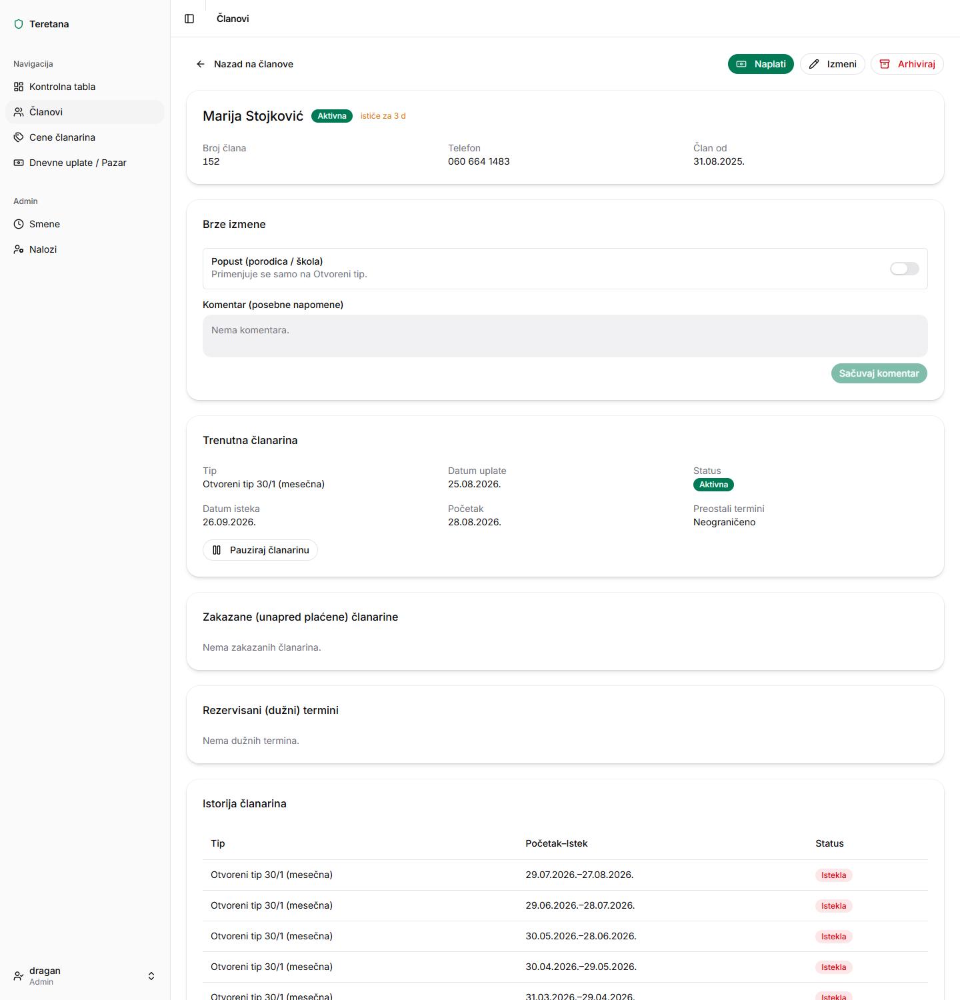
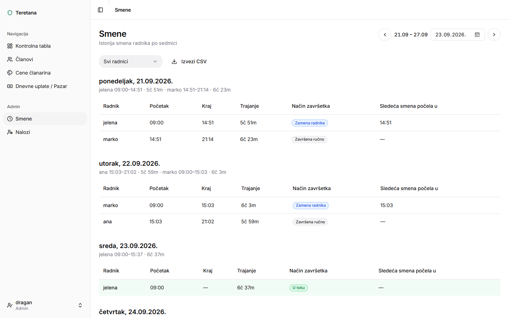
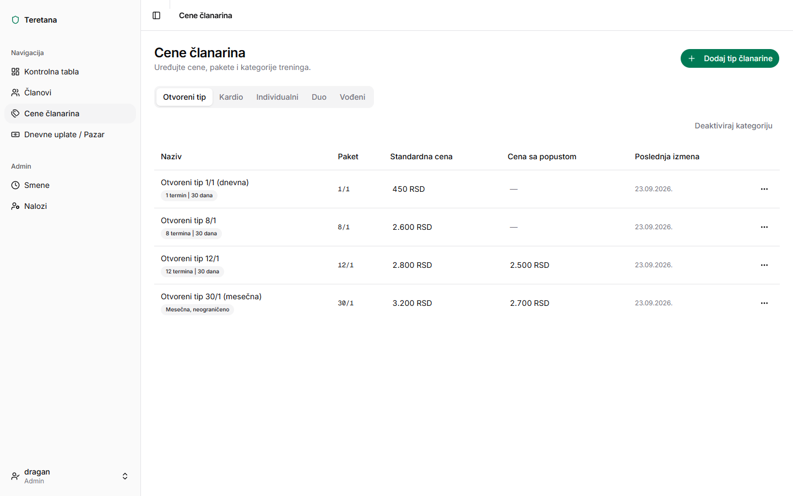
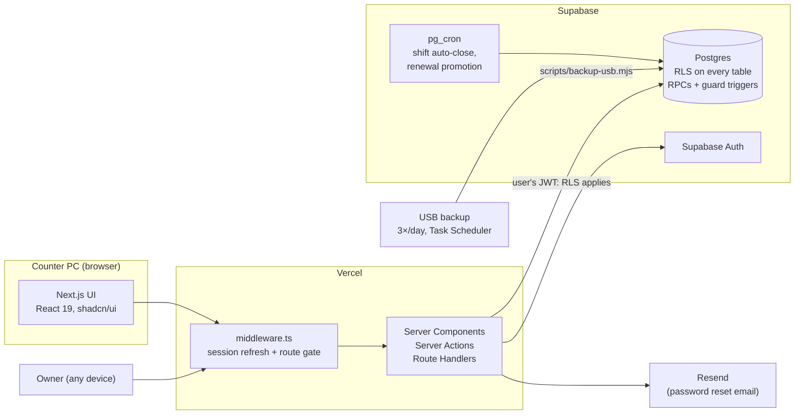
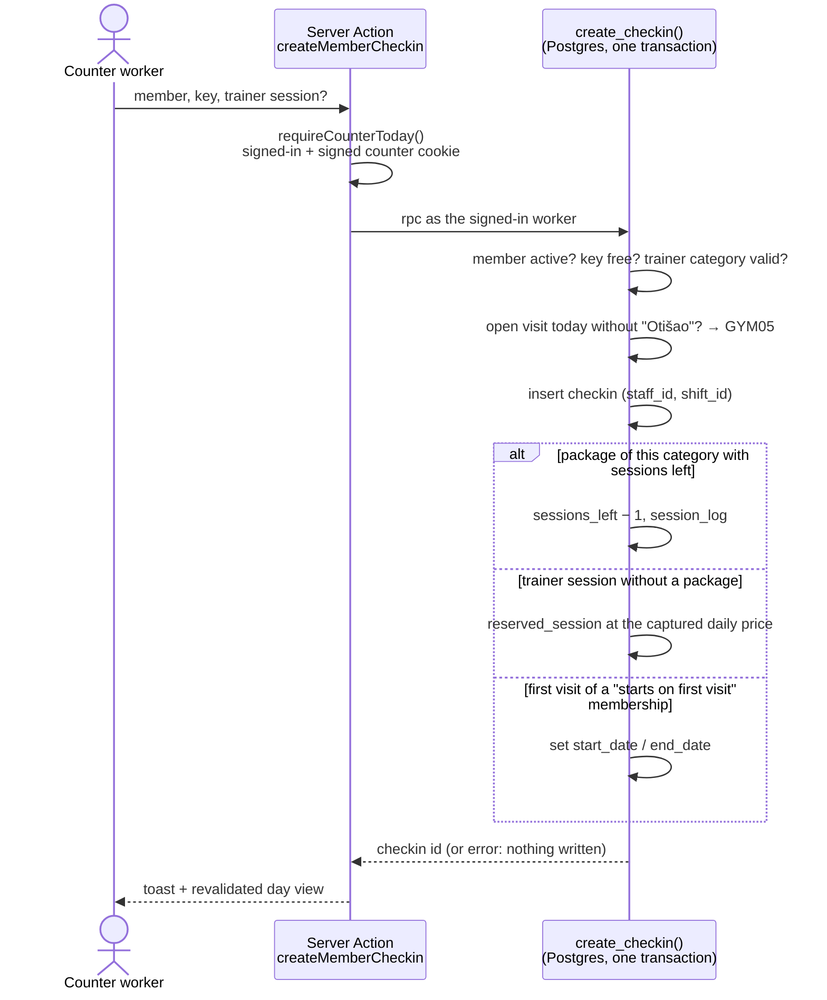

# Gym Management System

Front-desk app for a family-run gym in Belgrade. It covers member check-in with physical
keys, cash payments and daily takings, memberships with sessions, pauses and prepaid
renewals, and worker shifts with handover. It is built for the staff at one physical
counter, not for members. The UI is in Serbian, prices are in RSD, and the business day
follows Europe/Belgrade.

[](https://github.com/NiksaHalas/GymManagementSystem/actions/workflows/ci.yml)

**[Live demo →](https://gym-management-system-five-ashy.vercel.app)**: pick
*Isprobaj kao radnik* (counter worker) or *Isprobaj kao admin* (owner). An English guide
explains the Serbian UI. All demo data is synthetic. A generator produces it, and it is
rebuilt every night.



## The problem

The gym ran on a paper ledger at the counter:

- members' names and remaining sessions were written by hand;
- cash went into a drawer;
- the owner learned the day's takings from whoever closed.

The counter needed something one worker can operate between conversations with members,
without training. It had to:

- check a member in and hand out a key in two clicks;
- take a payment without doing arithmetic;
- hand the shift to the next worker so every payment stays attributed.

The owner needed to see takings, shifts and member history remotely, and to trust that a
worker cannot quietly edit yesterday's cash.

## What it does

### Check-in and keys

Search by name, surname or member number, pick a free key (1–22), confirm. The dialog
shows the membership status and the remaining sessions. A trainer session deducts from
the package of the same training category. With no package, it is recorded as a debt at
that category's daily price. A member who has not been marked as left cannot be
checked in again the same day. **Otišao** ("left") returns the key.

| Counter dashboard | Check-in dialog |
|---|---|
|  |  |

### Payments and takings

The cash price comes from the price list, with a family/school discount where it applies
and an optional lower custom amount with a reason. A payment settles any open session
debt. Paying while a membership is still running queues the next one (*zakazana*). It
starts when the current one ends. Workers see daily takings. The owner also sees month
and year totals, with CSV export.



### Membership lifecycle

Memberships are time-based (30 days, unlimited) or session-based (8, 10, 12 sessions),
solo or with a trainer (individual, duo, guided group). A membership can:

- start on payment or on the first visit;
- be paused and resumed, with the end date extended by the paused days;
- keep its unused sessions after expiry, if the worker confirms using them.

The member card shows all of it: the current membership, prepaid renewals, open debt, and
the full membership, payment and training history.



### Shifts and handover

A worker's shift opens when they sign in at the counter. **Zameni radnika** hands it to
the next worker, who signs in with their own password. **Završi smenu** ends the shift and signs out. A scheduled
job closes shifts left open after closing time. Every check-in and payment records the
shift it happened in. The owner's weekly view shows who worked when, how each shift ended
and gaps in counter coverage.



The owner also manages prices and packages (`/cene`) and staff accounts (`/nalozi`):



## Architecture



- **Next.js 15 App Router on Vercel.** Server Components read through a request-cached
  Supabase client. Writes are Server Actions, and every action runs with the signed-in
  worker's JWT, so Postgres row-level security applies to it. The service-role key is
  used only for account management and a few admin routes.
- **Postgres does the bookkeeping.** Check-in, payment, void, pause/resume and shift
  handover are Postgres functions (RPCs). Each one checks its rules and writes all of its
  rows in a single transaction.

### One check-in, one transaction



## Engineering decisions

- **RLS is the security boundary, not the UI.** RLS is enabled and forced on all 13
  tables, and `anon` has no table grants. Inserts on operational tables must name the
  signed-in user as their actor (`staff_id = auth.uid()`). Workers may change check-ins
  and payments only on today's business day, and only admins read shift history. A
  worker who bypasses the UI still hits the same rules.
- **Guard triggers for rules that must hold no matter who writes.** A trigger blocks
  archiving a member with unsettled debt. Another trigger makes restoring an archived
  member admin-only. The open-visit guard lives inside `create_checkin`. pgTAP tests cover
  all of these.
- **Atomic RPCs instead of multi-step writes from the app.** A check-in can touch up to
  five tables: check-in, membership, session log, reserved session and payment. Doing that
  from the app could leave half-applied state on a flaky connection. The RPC succeeds or
  writes nothing, and `void_checkin` / `void_payment` undo exactly what was applied.
- **The counter is a device, not a role.** Check-in and payment require a signed
  `gym_counter` cookie (HMAC-SHA256, httpOnly) that an admin sets on the counter PC. A
  worker signing in elsewhere gets a "counter only" page. The owner signing in remotely
  gets read and management views but cannot take cash. The accepted limit: the cookie is
  the same on every counter, so copying it would promote another machine. That is
  documented in [Tech.md §3.4](docs/Tech.md).
- **One business day, in Belgrade.** `business_today()` in Postgres and
  `lib/time/business-day.ts` in the app decide what "today" means. Same-day edit rights,
  daily takings and shift boundaries all use it, including across daylight-saving
  changes, which the unit tests cover.
- **Offline mode was built, then removed.** Phase 3 added a PWA with an IndexedDB outbox
  and client-generated ids for idempotent replay. It was rolled back the same day as a
  product decision ([PRD v1.22](docs/PRD.md)), and the counter is now online-only.
  Keeping it would have meant replaying writes after the fact against rules that Postgres
  checks at write time, such as open visits, session counts and same-day edits.
  Reliability instead comes from Supabase plus a USB backup three times a day. The
  database-side change was reverted by a forward migration, not by editing history.

## Numbers

Measured, not estimated. `node scripts/repo-metrics.mjs --bench` prints them from the repo
and the local Supabase stack.

| | |
|---|---|
| SQL migrations | 43 |
| Postgres functions in `public` | 23, 18 callable by signed-in staff |
| RLS policies | 47, on 13 of 13 tables |
| Vitest unit tests | 66 in 9 files |
| pgTAP assertions | 100 in 8 files |
| `create_checkin()` time inside Postgres | p50 0.18–0.20 ms, p95 0.35–0.51 ms |

The `create_checkin()` figures come from three runs of 200 calls each, as the counter
worker, on the demo dataset (~28,000 check-ins). They are database execution time only,
with no network or app layer, measured with `clock_timestamp()` on a local Docker
Postgres. Script: [`supabase/bench/checkin_latency.sql`](supabase/bench/checkin_latency.sql).

**Demo dataset.** [`supabase/demo/demo_generator.sql`](supabase/demo/demo_generator.sql)
simulates 12 months plus one warm-up month. It models personas (regulars, occasional
visitors, trainer clients, drop-outs, day passes) and seasonal, weekday and hourly arrival
patterns. It also generates pauses, prepaid renewals, debts, voids, Fitpass guests, and
shifts with handover. It is deterministic (`setseed`), so the numbers change only with the
date. For 2026-09-23 it produced 372 members, 28,021 check-ins, 3,480 payments and 675
shifts. It is synthetic data, not the gym's records.

## Bugs the tests and the demo data caught

Adding tests, a year of realistic data and a smoke test of the live demo exposed six bugs
that had shipped:

1. **"Završi smenu" silently did nothing.** A hardening migration removed workers' read
   access to `shift`. `end_shift()` still ran with the caller's rights, and an `UPDATE`
   also has to pass a read policy, so it matched 0 rows. Shifts stayed open until the
   scheduled auto-close. Surfaced by the pgTAP shift tests. Fixed by making it
   `SECURITY DEFINER`, scoped to the caller's own shift.
2. **Yearly takings were cut off at 1,000 payments.** PostgREST caps every response at
   `max_rows` without an error, and the month/year views summed rows in the app. The demo
   year has ~3,500 payments. Real use would have hit the cap after four to five months.
   Fixed by paging through all rows.
3. **Migrations failed on an empty database.** One migration revoked a function that only
   the hosted project had. Surfaced by running every migration from zero, as CI now
   does.
4. **Cyrillic weekday names on `/smene`.** In ICU, `sr-RS` resolves to Cyrillic, which
   clashed with the Latin-script UI. Surfaced by the demo data.
5. **Demo sign-in hung in production builds only.** The server action redirected to `/`,
   which redirects again. The action response then carried a `Location` header, and the
   client got HTML instead of its RSC payload. `next dev` did not show it. The
   media-capture script, run against `next build`, did.
6. **An expired package's session was offered on top of an active monthly membership.**
   A member who moved from an 8-session package to a monthly one kept the old package's
   unused sessions. At check-in the dialog offered to spend one, and `create_checkin`
   would deduct it, even though the monthly membership already covered the visit.
   Surfaced by the smoke test on the live demo. Seven generated members were affected.
   Fixed in both the dialog and the RPC, with pgTAP tests for both the solo and the
   trainer case.

## Testing and CI

- **Unit tests (Vitest):** business-day and DST handling, membership status, pricing,
  shift formatting, paging past the PostgREST row cap, Zod schemas.
- **Database tests (pgTAP):** check-in side effects and guards, sessions, payments and
  voids, pause/resume, RLS boundaries per role, shifts, and invariants of the generated
  demo data. The data invariants include: remaining sessions match counted visits, no
  arrivals outside opening hours, and every row is attributed to a covering shift.
- **CI** ([`.github/workflows/ci.yml`](.github/workflows/ci.yml)) runs on every PR and on
  `main`:
  - lint, typecheck, unit tests, `next build`;
  - all migrations plus the demo seed on an empty Postgres, then pgTAP;
  - gitleaks over the full history.

## Tech stack

Next.js 15 (App Router) · React 19 · TypeScript · Tailwind CSS v4 · shadcn/ui · Zod ·
Supabase (Postgres, Auth, RLS, pg_cron) · Resend · Vercel · Vitest · pgTAP · Playwright
(media capture only) · GitHub Actions

## Getting started

Needs Node 20+, Docker and the Supabase CLI (installed as a dev dependency).

```bash
npm install
npx supabase start          # local Postgres + Auth in Docker
npx supabase db reset       # all migrations + demo data for today
npm run dev
```

Point `.env.local` at the local stack. `npx supabase status` prints the URL and keys, and
the full list of variables is in [`.env.example`](.env.example) and
[Tech.md §10](docs/Tech.md). With `DEMO_MODE=true` and `DEMO_ADMIN_PASSWORD` /
`DEMO_WORKER_PASSWORD` set, the login page shows the demo buttons.
`npm test` runs the unit tests, and `npm run test:db` runs pgTAP.

There are no default credentials. A real deployment gets its admin accounts from
`scripts/seed-admins.mjs` and starts with an empty database, without the demo generator.
See [docs/go-live.md](docs/go-live.md).

## Documentation

- [docs/PRD.md](docs/PRD.md): product requirements and implementation status
- [docs/Tech.md](docs/Tech.md): architecture, auth, deployment, environment
- [docs/DB.md](docs/DB.md): schema, RLS, RPCs, scheduled jobs
- [docs/demo.md](docs/demo.md): how the public demo is set up and reset
- [docs/go-live.md](docs/go-live.md), [docs/smoke-test.md](docs/smoke-test.md),
  [docs/backup-setup.md](docs/backup-setup.md): runbooks for the real deployment

## How it was built

This project was built with [Claude Code](https://claude.com/claude-code) as the main
implementation tool (Cursor's agent for some earlier phases), working from docs rather
than ad-hoc prompts:

- **Docs are the source of truth.** [AGENTS.md](AGENTS.md) tells any agent working in the
  repo to read `docs/PRD.md`, `docs/Tech.md` and `docs/DB.md` before implementing. It
  also forbids inventing requirements or introducing patterns outside the architecture
  docs. Each of those docs keeps a changelog of what changed and why.
- **Delivery was phased,** mapped to the scope of work in [docs/Tech.md](docs/Tech.md)
  §12: auth and shift attribution first, then members, prices, check-ins and payments.
- **Pinned agent skills.** [`skills-lock.json`](skills-lock.json) and
  [`.agents/skills/`](.agents/skills/) vendor Supabase's Postgres and Supabase skills at a
  content hash. Schema and RLS work followed a fixed reference, not whatever the model
  recalled.
- **MCP servers** were used for Supabase (migrations, advisors) and shadcn/ui (component
  primitives).

The agents got things wrong, and the record is kept rather than tidied away:

- Of the six bugs above, 1, 3 and 5 came from commits co-authored by Claude. 2, 4 and 6
  came from commits by Cursor's agent.
- [docs/Tech.md](docs/Tech.md) §9 keeps a table of deployment incidents. One example:
  applying migrations through the Supabase MCP stamped the remote ledger with its own
  timestamps and drifted it from the repo filenames. It had to be reconciled with
  `supabase migration repair`.
