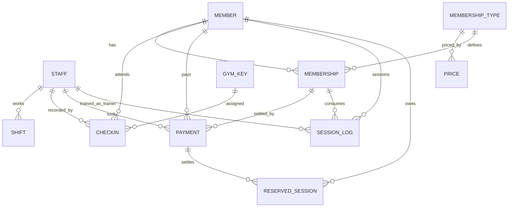

# DB — Database Schema

Version: 1.2
Date: 2026-06-14
Engine: **PostgreSQL (Supabase)**
Companion docs: `PRD.md` (product), `Tech.md` (architecture).

> v1.1 aligns this doc with the applied migrations in `supabase/migrations/` (UUID defaults, helper functions, the `handle_new_user` trigger, and the implemented RLS policies). Refinement deltas vs. v1.0 are called out inline.
> v1.2 adds the authentication-system artifacts: the `login_attempt` rate-limit table (§3.12) and the `pg_cron` shift auto-close job (§8). Migrations: `20260614142000_add_login_attempt_table`, `20260614142100_pgcron_shift_autoclose`.

This document defines the database schema for the Gym Management System. It follows the Supabase Postgres best-practices skill: lowercase `snake_case` identifiers, an index on every foreign key, partial/composite indexes for hot paths, and **RLS enabled and forced** on every table.

---

## 1. Conventions & decisions

- **Identifiers**: lowercase `snake_case`; tables are singular nouns.
- **Timestamps**: `timestamptz` everywhere (UTC). The **business day** is derived in `Europe/Belgrade` and stored as a `date` (`business_date`) on `checkin`/`payment` so day-grouping survives the midnight reset and offline sync.
- **Primary keys**:
  - **Reference/config tables** (`staff`, `membership_type`, `price`, `gym_key`): `bigint generated always as identity` (sequential, compact).
  - **Operational tables that can be created offline** (`member`, `membership`, `checkin`, `payment`, `session_log`, `reserved_session`, `shift`): **UUID** primary keys. **Refinement (v1.1):** the server-side column default is **`gen_random_uuid()`** (UUIDv4), because the `pg_uuidv7` extension is **not available on Supabase**. Clients that create rows offline still generate a **client-side UUIDv7** (time-ordered, stable id before sync) and send it as the `id`, so sync stays an idempotent upsert by `id`; only the DB fallback default differs (UUIDv4 instead of v7).
- **Money**: integer RSD (`amount_rsd int`), no decimals.
- **Soft delete**: `member.archived` (history preserved). Member numbers are never reused.
- **Audit**: mutable rows carry `created_by` / `updated_by` (→ `staff.id`) and `created_at` / `updated_at`.
- **RLS**: `enable row level security` + `force row level security` on all tables. Helper functions (`security definer`, `set search_path = public`): `current_staff()` resolves the caller's `staff` row from `auth.uid()`, `is_admin()` checks the role, and `business_today()` (`search_path = ''`) returns the Europe/Belgrade business day used by same-day write rules. A `handle_new_user()` trigger on `auth.users` auto-creates the linked `staff` row. See §5 for the implemented policies.

### 1.1 Enumerated types
```sql
create type staff_role          as enum ('user', 'admin');
create type training_type       as enum ('otvoreni', 'kardio', 'individualni', 'duo', 'vodjeni');
create type membership_status   as enum ('aktivna', 'istekla', 'pauzirana');
create type membership_start_mode as enum ('payment', 'first_visit');
create type payment_kind        as enum ('membership', 'debt_settlement', 'fitpass_surcharge');
create type shift_end_reason    as enum ('logout', 'switch', 'auto_close', 'inactivity');
```

> Note on membership status: the **"no membership"** state is represented by the **absence** of an active `membership` row for the member (not an enum value).

---

## 2. Entity-relationship overview



---

## 3. Tables

### 3.1 `staff`
Worker/Admin profile, 1:1 with `auth.users`. Trainers are staff.

```sql
create table staff (
  id             uuid primary key references auth.users (id) on delete restrict,
  username       text not null unique,
  role           staff_role not null default 'user',
  recovery_email text,                 -- set by Admin; used for password reset via Resend
  active         boolean not null default true,
  created_at     timestamptz not null default now(),
  updated_at     timestamptz not null default now()
);

create index staff_role_idx   on staff (role);
create index staff_active_idx on staff (active) where active;
```
- `username` is unique; login maps `username → <username>@gym.local` synthetic email for Supabase Auth.
- Minimum-2-Admins is an operational guideline (not DB-enforced), per product decision.

**Auto-provisioning of `staff` (refinement v1.1):** a trigger on `auth.users` creates the linked `staff` row on user creation, deriving `username` / `role` / `recovery_email` from the auth metadata (falling back to the email local-part for `username`). This lets accounts created later (Dashboard, app, or a seed script) link automatically.
```sql
create or replace function handle_new_user()
returns trigger language plpgsql
  security definer set search_path = public as $$
begin
  insert into public.staff (id, username, role, recovery_email)
  values (
    new.id,
    coalesce(new.raw_user_meta_data->>'username', split_part(new.email, '@', 1)),
    coalesce((new.raw_user_meta_data->>'role')::staff_role, 'user'),
    new.raw_user_meta_data->>'recovery_email'
  )
  on conflict (id) do nothing;
  return new;
end $$;

create trigger on_auth_user_created
  after insert on auth.users
  for each row execute function handle_new_user();
```

### 3.2 `shift`
Derived from login sessions; one row per worked shift.

```sql
create table shift (
  id          uuid primary key default gen_random_uuid(),
  staff_id    uuid not null references staff (id) on delete restrict,
  started_at  timestamptz not null default now(),
  ended_at    timestamptz,
  ended_reason shift_end_reason,
  created_at  timestamptz not null default now()
);

create index shift_staff_id_idx  on shift (staff_id);
create index shift_started_at_idx on shift (started_at);
create index shift_open_idx       on shift (staff_id) where ended_at is null;
```
- Handover closes the open shift (`ended_reason = 'switch'`) and opens a new one.
- A `pg_cron` job auto-closes stale open shifts (`auto_close`) at the gym's closing time + 20 min — see §8.
- Admin **remote view-only** logins do not create a shift (the device is not the registered counter — see `Tech.md` §3/§5).
- **Shift lifecycle (implemented):** opens automatically on counter login; a worker may **end** it manually (`ended_reason = 'logout'`); plain **sign-out does NOT close** the shift (it stays open until ended, handed over, or auto-closed).

### 3.3 `member`
The virtual card. Soft-deletable; permanent member number.

```sql
create table member (
  id            uuid primary key default gen_random_uuid(),
  member_no     bigint,                -- null until assigned on sync; never reused (uniqueness via partial unique index below)
  first_name    text not null,
  last_name     text not null,
  phone         text not null,         -- required; NOT unique (family sharing allowed, soft warning in app)
  discount_flag boolean not null default false,  -- family/school; any worker may toggle
  comment       text,                  -- special needs; triggers popup at check-in/payment
  archived      boolean not null default false,
  archived_at   timestamptz,
  created_by    uuid references staff (id),
  created_at    timestamptz not null default now(),
  updated_by    uuid references staff (id),
  updated_at    timestamptz not null default now()
);

-- member_no is unique only when assigned
create unique index member_member_no_uidx on member (member_no) where member_no is not null;
create index member_created_by_idx on member (created_by);
create index member_updated_by_idx on member (updated_by);
create index member_active_idx     on member (archived) where not archived;
create index member_phone_idx      on member (phone);
-- fast search by name / surname (trigram or prefix); enable pg_trgm if using fuzzy search
create index member_name_idx       on member (lower(last_name), lower(first_name));
```

**Member number assignment (offline-safe):**
```sql
create sequence member_no_seq;

-- Assign the next permanent number when a member is finalized (on server-side sync/insert)
create or replace function assign_member_no()
returns trigger language plpgsql
  security definer set search_path = public as $$   -- refinement (v1.1): runs as owner so it can use the sequence regardless of caller role
begin
  if new.member_no is null then
    new.member_no := nextval('member_no_seq');
  end if;
  return new;
end $$;

create trigger member_assign_no
  before insert on member
  for each row execute function assign_member_no();
```
- Offline-created members are shown with a temporary "pending" number client-side; the real `member_no` is assigned on sync (in sync order). Numbers are never reused because they come from a monotonic sequence and archiving does not free them.

### 3.4 `membership_type`
Catalog of training type + package combinations.

```sql
create table membership_type (
  id            bigint generated always as identity primary key,
  training_type training_type not null,
  package       text not null,          -- '1/1','8/1','10/1','12/1','16/1','30/1'
  label         text not null,          -- display label (Serbian)
  is_time_based boolean not null,       -- true => unlimited visits within duration
  sessions      int,                    -- session count for session-based; null for time-based
  duration_days int not null default 30,
  active        boolean not null default true,
  created_at    timestamptz not null default now(),
  unique (training_type, package)
);

create index membership_type_active_idx on membership_type (active) where active;
```
- `is_time_based = true`: Open type 30/1, Cardio 30/1, Open type discount 30/1.
- `is_time_based = false` (session-based, 30-day validity): all individual/duo/guided packages, daily 1/1, Open type 8/1 & 12/1.

### 3.5 `price`
Current price per membership type (no history in v1). A type may have a standard and a discount price.

```sql
create table price (
  id                 bigint generated always as identity primary key,
  membership_type_id bigint not null references membership_type (id) on delete cascade,
  amount_rsd         int not null check (amount_rsd > 0),
  is_discount_price  boolean not null default false,  -- family/school price (Open type only)
  active             boolean not null default true,
  updated_by         uuid references staff (id),
  updated_at         timestamptz not null default now(),
  unique (membership_type_id, is_discount_price)
);

create index price_membership_type_id_idx on price (membership_type_id);
create index price_updated_by_idx          on price (updated_by);
```

### 3.6 `membership`
A member's membership period. One active/paused at a time.

```sql
create table membership (
  id                 uuid primary key default gen_random_uuid(),
  member_id          uuid not null references member (id) on delete restrict,
  membership_type_id bigint not null references membership_type (id) on delete restrict,
  start_mode         membership_start_mode not null default 'payment',
  start_date         date,              -- null until first visit when start_mode='first_visit'
  end_date           date,
  sessions_total     int,               -- null for time-based
  sessions_left      int,               -- null for time-based
  status             membership_status not null default 'aktivna',
  paused_days        int not null default 0,
  paused_at          timestamptz,       -- set while paused
  created_by         uuid references staff (id),
  created_at         timestamptz not null default now(),
  updated_by         uuid references staff (id),
  updated_at         timestamptz not null default now(),
  check (sessions_left is null or sessions_left >= 0)
);

create index membership_member_id_idx        on membership (member_id);
create index membership_membership_type_id_idx on membership (membership_type_id);
create index membership_created_by_idx        on membership (created_by);
create index membership_end_date_idx          on membership (end_date);   -- soon-to-expire queries
-- enforce a single active/paused membership per member
create unique index membership_one_active_uidx
  on membership (member_id)
  where status in ('aktivna', 'pauzirana');
```
- **Start from first visit**: `start_date` is set on the member's first check-in; `end_date` is computed from it.
- **Pause/resume**: pausing sets `status='pauzirana'` and records `paused_at`; resuming adds the elapsed paused days to `paused_days` and **extends `end_date`** by that amount. No pause limit.
- **Expiry**: a scheduled job (or read-time computation) flips `aktivna → istekla` when `end_date < today` and sessions are exhausted/expired. Remaining sessions may still be used after expiry via override.
- **Renewal**: a new `membership` row (new period); prior rows remain as history.

### 3.7 `payment`
Cash payments. `member_id` is null for anonymous Fitpass.

```sql
create table payment (
  id                 uuid primary key default gen_random_uuid(),
  member_id          uuid references member (id) on delete restrict,      -- null = Fitpass
  staff_id           uuid not null references staff (id) on delete restrict,
  membership_type_id bigint references membership_type (id) on delete restrict,
  membership_id      uuid references membership (id) on delete set null,  -- created/extended membership (for revert)
  kind               payment_kind not null default 'membership',
  amount_rsd         int not null check (amount_rsd >= 0),                 -- 0 allowed for non-group Fitpass check-in record
  is_custom_price    boolean not null default false,                      -- custom must be < standard and > 0
  custom_reason      text,                                                -- optional note
  is_fitpass         boolean not null default false,
  business_date      date not null,                                       -- Europe/Belgrade day
  paid_at            timestamptz not null default now(),
  voided             boolean not null default false,
  voided_by          uuid references staff (id),
  voided_at          timestamptz,
  void_reason        text,
  created_by         uuid references staff (id),
  created_at         timestamptz not null default now(),
  updated_by         uuid references staff (id),
  updated_at         timestamptz not null default now()
);

create index payment_member_id_idx          on payment (member_id);
create index payment_staff_id_idx            on payment (staff_id);
create index payment_membership_type_id_idx  on payment (membership_type_id);
create index payment_membership_id_idx       on payment (membership_id);
create index payment_created_by_idx          on payment (created_by);
create index payment_voided_by_idx           on payment (voided_by);
-- daily/monthly/yearly takings: scan by business_date, exclude voided
create index payment_business_date_idx       on payment (business_date) where not voided;
```
- **Takings ("pazar")** = sum of `amount_rsd` grouped by `business_date` where `not voided` (net total).
- **Void** sets `voided=true` (kept in history) and a transaction **reverts the linked `membership`** change (restore `sessions_left`, roll back `end_date`/period).
- **Custom price** enforced in app: `0 < amount_rsd < standard price`.

### 3.8 `checkin`
Daily arrivals. `member_id` null = Fitpass. Determines key occupancy.

```sql
create table checkin (
  id                  uuid primary key default gen_random_uuid(),
  member_id           uuid references member (id) on delete restrict,     -- null = Fitpass
  staff_id            uuid not null references staff (id) on delete restrict,
  membership_id       uuid references membership (id) on delete set null,
  key_no              int references gym_key (key_no),                    -- nullable: allowed when all keys taken
  with_trainer        boolean not null default false,
  training_type       training_type,                                      -- set when with_trainer
  trainer_id          uuid references staff (id),                         -- set when with_trainer
  decremented_session boolean not null default false,
  is_fitpass          boolean not null default false,
  key_returned        boolean not null default false,                     -- "otišao" sets true
  checked_out_at      timestamptz,
  business_date       date not null,                                      -- Europe/Belgrade day
  created_at          timestamptz not null default now(),
  created_by          uuid references staff (id),
  updated_by          uuid references staff (id),
  updated_at          timestamptz not null default now(),
  check (not with_trainer or (training_type is not null and trainer_id is not null)),
  check (is_fitpass or member_id is not null),                            -- member required unless Fitpass
  check (not is_fitpass or key_no is not null)                            -- Fitpass requires a key
);

create index checkin_member_id_idx    on checkin (member_id);
create index checkin_staff_id_idx      on checkin (staff_id);
create index checkin_trainer_id_idx    on checkin (trainer_id);
create index checkin_membership_id_idx on checkin (membership_id);
create index checkin_key_no_idx        on checkin (key_no);
create index checkin_created_by_idx    on checkin (created_by);
create index checkin_business_date_idx on checkin (business_date);
-- currently-out keys (occupancy) and last holder of a key
create index checkin_open_key_idx      on checkin (key_no, created_at desc) where not key_returned;
```
- **Key occupancy**: keys with an open (`not key_returned`) check-in for the current business day.
- **Shared keys**: multiple open check-ins may reference the same `key_no`; the **latest assignment** (max `created_at`) is treated as the current/last holder. **Key search** returns the last member who held the key.
- **"Otišao"** sets `key_returned=true`, `checked_out_at=now()`.
- **End of day**: keys still open at midnight are surfaced in a next-day report (they stay `key_returned=false`).
- **Duo**: two independent check-ins (no linkage). **Guided/group**: one check-in per participant; same `trainer_id`.

### 3.9 `session_log`
History of consumed trainer sessions (dates on the card).

```sql
create table session_log (
  id            uuid primary key default gen_random_uuid(),
  member_id     uuid not null references member (id) on delete restrict,
  membership_id uuid references membership (id) on delete set null,
  checkin_id    uuid references checkin (id) on delete set null,
  trainer_id    uuid references staff (id),
  training_type training_type not null,
  session_date  date not null,
  created_at    timestamptz not null default now()
);

create index session_log_member_id_idx     on session_log (member_id);
create index session_log_membership_id_idx  on session_log (membership_id);
create index session_log_checkin_id_idx     on session_log (checkin_id);
create index session_log_trainer_id_idx     on session_log (trainer_id);
```

### 3.10 `reserved_session`
Owed (reserved) trainer sessions when the member had 0 sessions.

```sql
create table reserved_session (
  id                  uuid primary key default gen_random_uuid(),
  member_id           uuid not null references member (id) on delete restrict,
  checkin_id          uuid references checkin (id) on delete set null,
  training_type       training_type not null,
  session_date        date not null,
  amount_rsd          int not null check (amount_rsd > 0),  -- daily price CAPTURED at incur time
  settled             boolean not null default false,
  settled_payment_id  uuid references payment (id) on delete set null,
  settled_at          timestamptz,
  created_by          uuid references staff (id),
  created_at          timestamptz not null default now()
);

create index reserved_session_member_id_idx   on reserved_session (member_id);
create index reserved_session_checkin_id_idx   on reserved_session (checkin_id);
create index reserved_session_payment_idx      on reserved_session (settled_payment_id);
create index reserved_session_created_by_idx   on reserved_session (created_by);
create index reserved_session_unsettled_idx    on reserved_session (member_id) where not settled;
```
- The owed amount is the **captured daily price** at the time the debt was incurred (immune to later price changes).
- The system **warns after 3** unsettled rows; archiving a member is **blocked** while unsettled rows exist.
- Settled at next payment → `settled=true`, links `settled_payment_id`.

### 3.11 `gym_key`
The 22 physical keys (seeded reference data).

```sql
create table gym_key (
  key_no int primary key check (key_no between 1 and 22),
  active boolean not null default true
);

-- seed
insert into gym_key (key_no)
select generate_series(1, 22);
```
- Current/last holder is **derived from `checkin`** (latest assignment), not stored here.

### 3.12 `login_attempt`
Rate-limiting ledger for failed logins. Written/read **only by the service-role client** (the login server action), never by the browser.

```sql
create table login_attempt (
  id            bigint generated always as identity primary key,
  attempt_key   text not null,     -- "login:<username>:<ip>"
  attempted_at  timestamptz not null default now()
);

create index login_attempt_key_at_idx on login_attempt (attempt_key, attempted_at);

-- Only the service role touches this table
revoke all on login_attempt from anon, authenticated;
grant all on login_attempt to service_role;

alter table login_attempt enable row level security;
alter table login_attempt force row level security;
```
- The login action records one row per failed attempt keyed by `username + IP`. Login is blocked when **≥ 5 failed attempts** fall within a **15-minute** window; successful login clears the rows for that key.
- RLS is `enable`d + `force`d with **no policies** by design — `anon`/`authenticated` are revoked, and `service_role` bypasses RLS. (Supabase's linter flags this as INFO `rls_enabled_no_policy`, which is expected here.)

---

## 4. Seed data

### 4.1 Membership types
| training_type | package | is_time_based | sessions | label |
|---|---|---|---|---|
| individualni | 1/1 | false | 1 | Individualni 1/1 (dnevna) |
| individualni | 8/1 | false | 8 | Individualni 8/1 |
| individualni | 10/1 | false | 10 | Individualni 10/1 |
| individualni | 12/1 | false | 12 | Individualni 12/1 |
| duo | 1/1 | false | 1 | Duo 1/1 (dnevna) |
| duo | 8/1 | false | 8 | Duo 8/1 |
| duo | 10/1 | false | 10 | Duo 10/1 |
| duo | 12/1 | false | 12 | Duo 12/1 |
| vodjeni | 1/1 | false | 1 | Vođeni 1/1 (dnevna) |
| vodjeni | 8/1 | false | 8 | Vođeni 8/1 |
| vodjeni | 10/1 | false | 10 | Vođeni 10/1 |
| vodjeni | 12/1 | false | 12 | Vođeni 12/1 |
| vodjeni | 16/1 | false | 16 | Vođeni 16/1 |
| otvoreni | 1/1 | false | 1 | Otvoreni tip 1/1 (dnevna) |
| otvoreni | 8/1 | false | 8 | Otvoreni tip 8/1 |
| otvoreni | 12/1 | false | 12 | Otvoreni tip 12/1 |
| otvoreni | 30/1 | true | null | Otvoreni tip 30/1 (mesečna) |
| kardio | 30/1 | true | null | Kardio 30/1 (mesečna) |

### 4.2 Prices (RSD)
| type / package | standard | discount (Open type only) |
|---|---|---|
| individualni 1/1 | 1,200 | — |
| individualni 8/1 | 8,800 | — |
| individualni 10/1 | 9,800 | — |
| individualni 12/1 | 11,800 | — |
| duo 1/1 | 1,000 | — |
| duo 8/1 | 6,800 | — |
| duo 10/1 | 7,800 | — |
| duo 12/1 | 8,800 | — |
| vodjeni 1/1 | 1,000 | — |
| vodjeni 8/1 | 3,600 | — |
| vodjeni 10/1 | 4,100 | — |
| vodjeni 12/1 | 4,600 | — |
| vodjeni 16/1 | 5,100 | — |
| otvoreni 1/1 | 450 | — |
| otvoreni 8/1 | 2,600 | — |
| otvoreni 12/1 | 2,800 | 2,500 |
| otvoreni 30/1 | 3,200 | 2,700 |
| kardio 30/1 | 2,600 | — |

> The **Fitpass group surcharge (+300)** is recorded directly on `payment` (`is_fitpass=true`, `kind='fitpass_surcharge'`), not as a `membership_type`.

---

## 5. Row-Level Security (implemented)

RLS is `enable`d + `force`d on every table. Helper functions are `security definer` so they can read `staff` inside policies without recursion (the `postgres` owner has `BYPASSRLS`), with a pinned `search_path`:

```sql
create or replace function current_staff()
returns staff language sql stable
  security definer set search_path = public as $$
  select * from staff where id = auth.uid();
$$;

create or replace function is_admin()
returns boolean language sql stable
  security definer set search_path = public as $$
  select exists (select 1 from staff where id = auth.uid() and role = 'admin' and active);
$$;

-- business day in Europe/Belgrade, used by the same-day write rules
create or replace function business_today()
returns date language sql stable set search_path = '' as $$
  select (now() at time zone 'Europe/Belgrade')::date;
$$;
```

Policy intent (per `PRD.md` §2):

| Table | User (front desk) | Admin |
|---|---|---|
| `member` | select/insert/update (any member, anytime) | full |
| `membership`, `price` read | read | read |
| `price` write | — | full |
| `checkin`, `payment` insert | yes | yes |
| `checkin`, `payment` update/void | **only where `business_date = today`** (Europe/Belgrade) | any day |
| `payment` monthly/yearly aggregates | **today-and-back daily only** | full |
| `shift` | no read | read |
| `staff` (accounts) | read self | full (create/disable/reset) |
| `membership_type` | read | full |

### 5.1 Implemented policies
All policies target the `authenticated` role (`anon` has no table grants):

| Table | SELECT `using` | INSERT `with check` | UPDATE `using` / `with check` | DELETE `using` |
|---|---|---|---|---|
| `staff` | `id = auth.uid() or is_admin()` | `is_admin()` | `is_admin()` / `is_admin()` | `is_admin()` |
| `shift` | `is_admin()` | `staff_id = auth.uid() or is_admin()` | `staff_id = auth.uid() or is_admin()` (both) | — |
| `member` | `true` | `created_by = auth.uid()` | `true` / `updated_by = auth.uid()` | `is_admin()` |
| `membership` | `true` | `created_by = auth.uid()` | `true` / `updated_by = auth.uid()` | `is_admin()` |
| `membership_type` | `true` | `is_admin()` | `is_admin()` / `is_admin()` | `is_admin()` |
| `price` | `true` | `is_admin()` | `is_admin()` / `is_admin()` | `is_admin()` |
| `gym_key` | `true` | `is_admin()` | `is_admin()` / `is_admin()` | `is_admin()` |
| `payment` | `true` | `staff_id = auth.uid()` | `is_admin() or business_date = business_today()` (both) | `is_admin()` |
| `checkin` | `true` | `staff_id = auth.uid()` | `is_admin() or business_date = business_today()` (both) | `is_admin()` |
| `session_log` | `true` | `true` | `is_admin()` / `is_admin()` | `is_admin()` |
| `reserved_session` | `true` | `created_by = auth.uid()` | `true` / `true` | `is_admin()` |

### 5.2 Notes
- **Actor binding (audit):** INSERT/UPDATE on operational tables enforce that the acting column equals `auth.uid()` — `created_by` (`member`, `membership`, `reserved_session`), `staff_id` (`payment`, `checkin`), `updated_by` (`member`/`membership` update). **Server actions using the `authenticated` (cookie) client MUST set these columns to the signed-in user, or the write is rejected by RLS.** Server-side code using the `service_role` key bypasses RLS.
- **Same-day rule for Users** on `payment`/`checkin` UPDATE: `business_date = business_today()` (Europe/Belgrade); Admins may edit any day.
- **Two intentional exceptions** (flagged WARN by Supabase's linter, accepted): `session_log_insert` and `reserved_session_update` use `with check (true)` because the schema has no actor column to bind to — `session_log` has no `created_by`, and a `reserved_session` is settled by whichever worker takes the next payment (not the creator). These rely on app-level checks. To close them at the DB level we would add `recorded_by` to `session_log` and `settled_by` to `reserved_session`.
- **Privileges:** `authenticated` and `service_role` are granted `select, insert, update, delete` on all tables (RLS is the real filter); `anon` is granted none. Helper functions have `execute` revoked from `anon`; trigger functions (`assign_member_no`, `handle_new_user`) additionally have it revoked from `authenticated` (triggers fire regardless of `execute` grants).
- **Auto-enable safety net:** a pre-existing project-level event trigger (`ensure_rls` → `rls_auto_enable()`) auto-enables RLS on any new `public` table; migrations additionally `force` it.

---

## 6. Notes on offline & sync (DB-side)
- UUID PKs let the client create `member`/`checkin`/`payment` rows offline with final IDs; sync is an **idempotent upsert by `id`**. Offline clients send their own **client-side UUIDv7**; the DB column default is `gen_random_uuid()` (UUIDv4) only as a server-side fallback (see §1).
- `business_date` is set at creation time (device clock, Europe/Belgrade) so offline rows land on the correct day.
- `member_no` is intentionally **nullable** and assigned server-side via `member_no_seq` so offline members never collide and numbers are never reused.
- Mostly-additive writes (new check-ins/payments) keep conflicts rare; edits use last-write-wins by `updated_at`, with same-day-only restrictions for Users enforced by RLS.

---

## 7. Index summary (hot paths)
- Member search: `member_name_idx`, `member_phone_idx`, `member_member_no_uidx`, plus trigram GIN (`member_first_name_trgm_idx`, `member_last_name_trgm_idx`) for fuzzy name search (§9).
- Dashboard (day): `checkin_business_date_idx`, `checkin_open_key_idx`.
- Takings: `payment_business_date_idx` (partial, excludes voided).
- Soon-to-expire: `membership_end_date_idx`.
- One-active-membership guarantee: `membership_one_active_uidx` (partial unique).
- Unsettled debt lookups / archive block: `reserved_session_unsettled_idx`.
- Login rate limiting: `login_attempt_key_at_idx`.
- Every foreign key column is indexed (see each table).

---

## 8. Scheduled jobs (`pg_cron`)

The `pg_cron` extension is enabled (`create extension if not exists pg_cron schema cron;`). One job is registered.

### 8.1 Shift auto-close safety net
`auto_close_shifts()` closes any still-open shift after the gym's **closing time + 20-minute grace**, stamping `ended_at` to the **actual closing time** (not "now") and `ended_reason = 'auto_close'`. It does **not** touch auth sessions, so a logged-in worker stays signed in.

Closing times (Europe/Belgrade):

| Day | Closing | Auto-close fires from |
|---|---|---|
| Mon–Fri | 21:00 | 21:20 |
| Saturday | 18:00 | 18:20 |
| Sunday | 16:00 | 16:20 |

```sql
create or replace function public.auto_close_shifts()
returns void language plpgsql
  security definer set search_path = public as $$
declare
  belgrade_now  timestamptz := now() at time zone 'Europe/Belgrade';
  belgrade_date date        := belgrade_now::date;
  dow           int         := extract(isodow from belgrade_now); -- 1=Mon..7=Sun
  close_time    time;
  close_instant timestamptz;
begin
  if    dow between 1 and 5 then close_time := '21:00';
  elsif dow = 6            then close_time := '18:00';
  else                          close_time := '16:00';
  end if;

  close_instant := (belgrade_date + close_time) at time zone 'Europe/Belgrade';
  if now() < close_instant + interval '20 minutes' then
    return;  -- grace period not elapsed
  end if;

  update public.shift
     set ended_at = greatest(close_instant, started_at),
         ended_reason = 'auto_close'
   where ended_at is null;
end $$;

revoke execute on function public.auto_close_shifts() from public, anon, authenticated;
grant  execute on function public.auto_close_shifts() to service_role;

-- Runs every 10 min, 14:00–20:00 UTC (covers all three Belgrade triggers across CET/CEST);
-- the function gates internally on local time, so frequent runs are safe.
select cron.schedule('auto-close-shifts', '*/10 14-20 * * *',
  $$ select public.auto_close_shifts(); $$);
```
- **DST-proof:** the schedule window is in UTC but the closing logic is computed in `Europe/Belgrade` inside the function, so it stays correct across CET/CEST.
- `EXECUTE` is revoked from `public`/`anon`/`authenticated` so the `SECURITY DEFINER` function is not a public RPC endpoint.

---

## 9. Member search (`pg_trgm`)

The Members page uses fuzzy search over name / surname / member number. Migrations: `20260614150000_member_search`, `20260614151000_harden_member_search`, `20260614152000_member_search_drop_phone`.

- Enables `pg_trgm` (in the `extensions` schema) and adds trigram GIN indexes on `member.first_name`, `member.last_name` (used by `ILIKE`/`similarity`).
- `search_members(q text, include_archived boolean, lim int, off int)` (`security invoker`, `search_path = public, extensions`) returns paginated member rows enriched with the single active/paused membership summary (`status`, `label`, `end_date`, `sessions_left`, `is_time_based`) plus a `total_count` for pagination.
  - Empty `q` → browse all active (or all when `include_archived`) ordered by `lower(last_name), lower(first_name)`.
  - Non-empty `q` → name match via `ILIKE` + `similarity` ordering; digit-normalized prefix match on `member_no`. Phone is intentionally not searchable (removed in `20260614152000`).
- `EXECUTE` granted to `authenticated`, revoked from `anon`/`public`.
