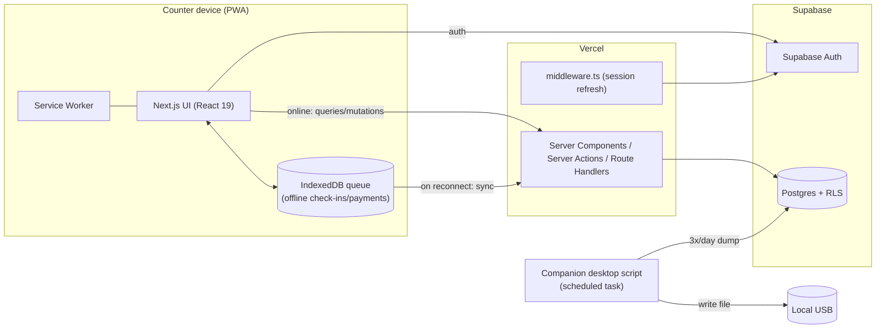

# Tech — Architecture & Technical Implementation

Version: 1.2
Date: 2026-06-15
Companion docs: `PRD.md` (product requirements), `DB.md` (database schema).

This document describes **how** the Gym Management System is built: the stack, the services, and how each requirement in `PRD.md` is implemented technically.

> v1.1 records the implemented **Members ("Članovi")** feature (list + fuzzy search + virtual card + create/edit/archive) under `(app)/clanovi`, the supporting `lib/members/` and `lib/time/` helpers, and the member-search migrations (mirrored in `DB.md` §9). See §2.1, §7, and §12.
> v1.2 records the implemented **Dashboard (daily check-in)** under `(app)/dashboard`, `lib/dashboard/`, Postgres RPCs `create_checkin` / `void_checkin` (`DB.md` §10), the `training_category` refactor on `/cene`, session/auth deduplication (`lib/supabase/server-client.ts`, `React.cache()` + `getUser()` in server components), migration `20260615140000_dashboard_support` (applied remotely as `dashboard_support`), and member-search cleanup migrations `20260615200000` / `20260615210000` (no phone; single RPC overload).

---

## 1. Stack at a glance

| Layer | Choice | Notes |
|---|---|---|
| Framework | **Next.js 15** (App Router) | Full-stack: UI + server actions + route handlers |
| UI runtime | **React 19** | Server Components by default, Client Components where interactivity is needed |
| Language | **TypeScript 5** (strict) | Path alias `@/*` → project root |
| Styling | **Tailwind CSS v4** | Configured via `@tailwindcss/postcss`; CSS variables theme |
| UI components | **shadcn/ui** (`radix-luma` style, base color `zinc`) | Built on `radix-ui`; icons from `lucide-react` |
| Database | **Supabase Postgres** | See `DB.md` |
| Auth | **Supabase Auth** | Username + password via synthetic email mapping |
| Email | **Resend** | Used only for worker password reset |
| Hosting | **Vercel** (app) + **Supabase** (DB/Auth) | |
| Delivery | **PWA** | Installable on Chrome/Edge; offline check-in + payment |
| Backup | **Companion desktop script** | Scheduled dump to USB 3×/day |

### 1.1 Already installed (from `package.json`)

Dependencies:
- `next@^15.5.19`, `react@19.2.4`, `react-dom@19.2.4`
- `@supabase/ssr@^0.10.3`, `@supabase/supabase-js@^2.108.1`
- `radix-ui@^1.5.0`, `lucide-react@^1.17.0`
- `class-variance-authority@^0.7.1`, `clsx@^2.1.1`, `tailwind-merge@^3.6.0`, `tw-animate-css@^1.4.0`
- `resend@^6.12.4`

Dev dependencies:
- `tailwindcss@^4`, `@tailwindcss/postcss@^4`
- `shadcn@^4.11.0`
- `typescript@^5`, `@types/node@^20`, `@types/react@^19`, `@types/react-dom@^19`
- `eslint@^9`, `eslint-config-next@16.2.7`

Already wired in the repo:
- `utils/supabase/server.ts` — server-side Supabase client (cookie-based, for RSC/server actions).
- `utils/supabase/client.ts` — browser Supabase client.
- `utils/supabase/middleware.ts` + root `middleware.ts` — refreshes the auth session on every HTTP request (`supabase.auth.getUser()` once in middleware).
- `lib/supabase/server-client.ts` — cached Supabase server client per RSC request (`React.cache()`).
- `utils/resend/client.ts` + `utils/resend/send.ts` — Resend client and `sendEmail()` helper.
- `components/ui/button.tsx` — first shadcn primitive; `lib/utils.ts` exposes `cn()`.
- `components.json` — shadcn config (`style: radix-luma`, `baseColor: zinc`, aliases for `@/components`, `@/components/ui`, `@/lib`, `@/hooks`).
- `app/layout.tsx` + `app/globals.css` — root layout and Tailwind v4 theme.

### 1.2 Installed UI & libraries
- shadcn primitives: `input`, `label`, `form`, `card`, `sonner`, `alert-dialog`, `dialog`, `dropdown-menu`, `table`, `badge`, `switch`, `separator`, `select`, `textarea`, `sidebar`, `sheet`, `tooltip`, `skeleton`, **`command`**, **`popover`**, **`checkbox`**, **`tabs`**, `input-group` (dashboard search + Fitpass/check-in dialogs; cene tabs).
- **Zod**, **react-hook-form**, **@hookform/resolvers** — auth and member forms.
- **`@tanstack/react-query`** — not yet installed; dashboard v1 uses `router.refresh()` + server actions (same pattern as `clanovi`).

### 1.3 Still to add
- `@tanstack/react-query` (optional until offline/optimistic check-in in Phase 3).
- PWA layer: service worker + IndexedDB offline queue (see §6).
- Companion backup script (Node) — see §8.

> **UI rule:** always use shadcn/ui primitives from `@/components/ui/*`, pulled/verified via the shadcn MCP, before writing custom UI. Keep styling in Tailwind and reuse shadcn variants.

---

## 2. High-level architecture



- **Rendering**: Server Components fetch data through the cached server Supabase client; interactive dashboard pieces (search, dialogs, table actions) are Client Components.
- **Mutations**: **Server Actions** for online writes. Check-in mutations call Postgres RPCs (`create_checkin`, `void_checkin`) for atomic side effects (session deduction, reserved debt, first-visit activation).
- **Session**: `middleware.ts` calls `getUser()` once per HTTP request to refresh/validate the JWT cookie. Server Components call cached `getUser()` via `lib/auth/session.ts` (one Auth API call per render tree). See §3.5.

### 2.1 Proposed folder structure
```
app/
  (auth)/                       # unauthenticated shell (implemented)
    login/                      # login page + form + signIn action
    zaboravljena-lozinka/       # forgot password (request reset by username)
    reset/                      # set new password (consumes recovery link)
  (app)/
    layout.tsx                  # authenticated shell + sidebar (implemented)
    dashboard/                  # daily check-in (implemented)
      page.tsx                  # server fetch, counter vs remote branch
      actions.ts                # check-in, Fitpass, otišao, key update, void
      dashboard-counter.tsx     # operativni layout (counter + today)
      dashboard-overview.tsx    # remote admin read-only
      date-nav.tsx              # ?date= navigacija
      checkin-search.tsx        # Command combobox + Novi član + Fitpass
      checkin-dialog.tsx        # ključ, trener sesija, komentar popup
      fitpass-dialog.tsx
      arrivals-table.tsx
      keys-panel.tsx
      soon-expire-badge.tsx
    clanovi/                    # members list + search + create dialog (implemented)
      [id]/                     # virtual card: status, quick edits, membership, history, archive (implemented)
    cene/                       # membership prices (implemented: tabbed catalog, inline price edit)
      actions.ts, cene-client.tsx, price-cell.tsx, add-type-dialog.tsx
    pazar/                      # daily/monthly/yearly takings (placeholder page)
    smene/                      # shifts admin view (stub page; lifecycle in lib/shifts/)
    nalozi/                     # accounts (admin) + counter-device toggle (implemented)
  api/
    admin/accounts/             # service-role account management (implemented)
components/
  ui/                           # shadcn primitives
  app-sidebar.tsx, app-header.tsx, switch-worker-dialog.tsx, counter-device-toggle.tsx, placeholder-page.tsx  # (implemented)
lib/
  utils.ts                      # cn() + helpers
  nav.ts                        # sidebar nav items + active-state + page titles (implemented)
  auth/                         # session/role guards, username<->email, counter cookie, password reset (implemented)
  shifts/                       # shift lifecycle server actions (implemented)
  members/                      # member zod schema, status derivation, types, formatting (implemented)
  catalog/                      # membership catalog view-models (implemented)
  dashboard/                    # dashboard queries, zod schemas, format (implemented)
  supabase/
    server-client.ts            # cached getServerSupabase() per RSC request (implemented)
  db/                           # typed queries + generated types (lib/db/types.ts)
  offline/                      # IndexedDB queue + sync engine
  time/                         # Europe/Belgrade business-day helpers (implemented: business-day.ts)
utils/
  supabase/{server,client,middleware,admin}.ts
  resend/{client,send}.ts
supabase/
  migrations/                   # SQL migrations (see DB.md)
scripts/
  seed-admins.mjs               # one-time admin seed (implemented)
  backup-usb.mjs                # companion backup script (planned, Phase 3)
```

### 2.2 Training categories (`training_category`)
The former `training_type` Postgres enum is replaced by a **`training_category` lookup table** so Admins can add categories at runtime (`DB.md` §3.4, migration `20260615120000_training_category_refactor`). Each row carries:
- **`is_trainer_based`**: when true, check-in with a trainer deducts a session and requires a trainer selection.
- **`per_trainee`**: duo-style pricing (amount charged per trainee).
- **`active` + `sort_order`**: soft-deactivate hides from workers; tab order on `/cene`.

`membership_type` references `training_category_id` (unique per `(category, package)`). Billing model (time-based vs session-based) stays on `membership_type.is_time_based`. Discount prices remain tied to the `otvoreni` category code.

### 2.3 Dashboard (daily check-in)
Implemented at `(app)/dashboard` with data helpers in `lib/dashboard/`.

**Display modes** (`page.tsx` branches on `isCounterDevice()` + role + `?date=`):
| Mode | Condition | UI |
|---|---|---|
| **Operativni** | Counter cookie + today's business date | Full check-in: search, dialogs, keys panel, table actions |
| **Read-only worker** | No counter cookie, any date | Same layout minus mutations; amber banner |
| **Remote admin overview** | Admin + no counter cookie | `dashboard-overview.tsx`: day stats, arrivals list, link to `/pazar` |

**Data** (`lib/dashboard/queries.ts`):
- `fetchDayCheckins(businessDate)` — arrivals for the day (excludes voided), enriches with member + membership status + read-only payment badge for today.
- `fetchKeyOccupancy(businessDate)` — open keys (`not key_returned`, `not voided`) with last holder.
- `fetchSoonToExpire()` — memberships ending within 3 days.
- `fetchDayStats(businessDate, keyHolders?)` — counts for admin overview.

**Mutations** (`dashboard/actions.ts`): all guarded by `requireCounterToday()` (counter device + today). Call Postgres RPCs for atomic side effects:
- `checkInMember` → `create_checkin`
- `checkInFitpass` → `create_checkin` (`is_fitpass`, optional `is_group_fitpass` flag)
- `markLeft` → `key_returned` update
- `updateCheckinKey` → key reassignment on today's open check-in
- `voidCheckin` → `void_checkin`

**UI pieces**: `checkin-search` (shadcn `command`/`popover`, quick-create member via `CreateMemberDialog.onCreated`), `checkin-dialog` (key, trainer tick + category + trainer select, comment popup, reserved-session warn ≥3), `fitpass-dialog`, `arrivals-table`, `keys-panel`, `date-nav`, `soon-expire-badge`.

**Deferred from dashboard v1** (see `PRD.md` §9): payment dialog on dashboard, group Fitpass +300 RSD payment (flag only), offline queue, auto session deduction for non-trainer Open 8/1 & 12/1 packages, dedicated key-number search UI.

---

## 3. Authentication & authorization

### 3.1 Username + password (no public email)
- Supabase Auth requires an email identity, so each worker maps to a **synthetic internal email**: `"<username>@gym.local"` (domain is internal, never sent mail). Helpers in `lib/auth/username.ts` normalize (trim + lowercase), validate (letters/digits/`._-`, min 3), and map `username → email`.
- Login flow (`app/(auth)/login/actions.ts`): the UI takes `username` + `password`, the server maps `username → synthetic email`, calls `supabase.auth.signInWithPassword`, then checks `staff.active` (disabled accounts are signed back out and rejected).
- **Rate limiting:** failed attempts are recorded in the `login_attempt` table keyed by `username + IP`; **≥ 5 fails in 15 min** blocks further attempts until the window passes. Successful login clears the key. (Uses the service-role client; see `DB.md` §3.13.)
- A `staff` profile row (see `DB.md`) is linked 1:1 to `auth.users.id` and stores `username`, `role`, `recovery_email`, and `active`.

### 3.2 Password reset (Resend)
- Each `staff` record has a **recovery email** (set by an Admin).
- Reset flow (`lib/auth/password-reset.ts`): self-service from the `/zaboravljena-lozinka` page (enter username) or Admin-initiated from the Accounts page. The **service-role admin client** calls `auth.admin.generateLink({ type: 'recovery' })` with `redirectTo = <site>/reset`, and the link is emailed to the `recovery_email` via the existing `sendEmail()` helper (`utils/resend/send.ts`). Links are valid **1 hour** (Supabase default OTP expiry).
- The `/reset` page consumes the recovery session and calls `supabase.auth.updateUser({ password })` (min 8 chars).
- Self-service responses never reveal whether a username exists (no user enumeration).
- Requires `RESEND_API_KEY`, `RESEND_FROM_EMAIL`, and `NEXT_PUBLIC_SITE_URL` to be configured (see §10).

### 3.3 Roles
- Two roles: `user` and `admin`, stored on the `staff` row.
- **Database-level**: Postgres **RLS** policies enforce access (e.g. only Admins can read monthly/yearly aggregates, manage accounts, or edit past-day logs). RLS reads the caller's role via a helper that joins `auth.uid()` to `staff.role`.
- **App-level**: the root `middleware.ts` redirects unauthenticated requests to `/login` (and authenticated users away from the auth pages); `requireUser()` / `requireAdmin()` (`lib/auth/session.ts`) guard the `(app)` shell and Admin-only segments (`/nalozi`, `/smene`). This is a UX layer on top of (never instead of) RLS.
- **Account management**: Admins create/disable/enable workers, set role, set recovery email, and trigger password resets via the `(app)/nalozi` page → `app/api/admin/accounts/route.ts` (service-role admin client). New accounts are created with a **permanent password set by the Admin** (no forced change on first login); `createUser` passes `username`/`role`/`recovery_email` as metadata so the `handle_new_user` trigger links the `staff` row.

### 3.4 Counter device vs. remote (view-only) — device binding
- Whether a login is a **counter session** (opens a shift) or a **remote view-only** session (no shift) is decided by **device binding**, not by which URL was used (URLs are convention-only and can be misused).
- The counter PC is marked once via an Admin-only action that writes a **signed, httpOnly `gym_counter` cookie** (HMAC-SHA256 over `COUNTER_DEVICE_SECRET`, 1-year TTL). `lib/auth/counter.ts` exposes `isCounterDevice()`, `setCounterDevice()`, `unsetCounterDevice()`; the toggle lives on the Accounts page.
- On a counter device, the `(app)` layout auto-ensures an open shift on each load. On any other device the cookie is absent, so **no shift is created** — this is how an Admin logging in from home gets the read-only overview.

### 3.5 Session reads & Auth API rate limits
- **Security**: never trust `getSession()` / cookie JWT alone — use **`getUser()`**, which validates the token with Supabase Auth.
- **Pattern** (implemented in `lib/auth/session.ts` + `lib/supabase/server-client.ts`):
  - **`middleware.ts`**: one `getUser()` per HTTP request — refreshes session cookies and gates routes.
  - **Server Components / server actions**: `getSessionUser()` and `getCurrentStaff()` call **`getUser()`** wrapped in **`React.cache()`** so layout + page share one lookup per render (not one per component).
  - **`getServerSupabase()`**: cached Supabase server client per RSC request (same cookie store).
- **Cost**: at most **two** `getUser()` calls per full page load (middleware + RSC cache miss) — acceptable vs. the prior N-call pattern that hit rate limits.
- **Guards**: `requireUser()` / `requireAdmin()` still redirect on missing/disabled accounts; sign-out on disabled uses `createClient()` directly when mutation is required.

---

## 4. Data layer

- **Supabase Postgres** with the schema in `DB.md`. All access goes through RLS-protected tables.
- **Clients**: `lib/supabase/server-client.ts` (`getServerSupabase`, cached per request) for RSC/dashboard queries; `utils/supabase/server.ts` for server actions that need a fresh client; `utils/supabase/client.ts` for browser-side reads and realtime if needed.
- **Types**: generate TypeScript types from the database (`supabase gen types typescript`) into `lib/db/types.ts` for end-to-end type safety.
- **Migrations**: SQL migrations live in `supabase/migrations/` and are the source of truth for the schema (`DB.md` mirrors them).
- **Query practices** (per the Supabase Postgres best-practices skill): index every foreign key, use partial/composite indexes for hot lookups (member search, daily takings by business date), keep transactions short, and rely on RLS for tenant/role isolation.

---

## 5. Shifts from auth sessions

- A shift is a `shift` row (`staff_id`, `started_at`, `ended_at`, `ended_reason`). Logic lives in `lib/shifts/actions.ts`.
- **Open a shift** automatically when a worker logs in on the counter device (the `(app)` layout calls `ensureOpenShift()`): if no shift is open it opens one; if a *different* worker's shift is open it treats login as a handover (closes old as `switch`, opens new); if the *same* worker already has one open it is reused (idempotent).
- **End shift (manual)**: a worker explicitly ends their shift (`ended_reason = 'logout'`) and **stays signed in**.
- **Sign-out ≠ end shift**: plain logout only clears the auth session and **leaves the shift open** (per product decision); the shift then ends via manual end, handover, or the auto-close safety net.
- **Handover ("switch worker")**: a server action re-authenticates the incoming worker by **username + password**, closes the current shift (`ended_reason = 'switch'`) and opens a new one — without tearing down app state. Fits the daily 09:00–15:00 / 15:00–21:00 rotation.
- **Safety net**: the Supabase **`pg_cron`** job `auto_close_shifts()` closes shifts still open past the gym's closing time + 20 min (`ended_reason = 'auto_close'`), stamping `ended_at` to the actual closing time **without** touching auth sessions. Closing times (Europe/Belgrade): **Mon–Fri 21:00, Sat 18:00, Sun 16:00**. See `DB.md` §8.
- **Admin remote view-only** logins are non-counter sessions (no `gym_counter` cookie) and **do not create** a shift (see §3.4).

---

## 6. Offline-first (PWA)

Mandatory offline operations: **check-in** and **payment**. Member creation/edits may wait for connectivity.

### 6.1 Service worker
- Installable PWA via a web app manifest + service worker (`@serwist/next` or `next-pwa`).
- The service worker pre-caches the app shell and static assets so the UI loads with no network.
- **Browser support**: Chrome/Edge get full installable-PWA behavior; **Firefox** runs the same app in-browser with working service-worker offline caching, but is **not installable as a standalone app window** — acceptable per product decision.

### 6.2 Offline write queue
- Check-in and payment writes are written **first to IndexedDB** (an append-only outbox) and reflected immediately in the UI (optimistic), then flushed to the server.
- Records use **client-generated UUIDs (UUIDv7)** as primary keys so offline rows have stable IDs and never collide on sync (see `DB.md` §PK strategy). This makes sync **idempotent** (upsert by id).
- The **business day** is derived from the device clock in **Europe/Belgrade** at creation time and stored on the row, so a check-in created offline lands on the correct day after sync.

### 6.3 Sync engine
- On reconnect (and periodically while online), a sync worker drains the IndexedDB outbox to a sync endpoint / server actions, upserting by `id`.
- **Member numbers**: a member created offline gets a temporary `pending` display number; on sync the server assigns the next real `member_no` via a Postgres sequence/trigger (in sync order). The permanent number is then reflected on the card.
- **Conflicts**: writes are mostly additive (new check-ins/payments), minimizing conflicts. For edits, last-write-wins by `updated_at` with the audit trail preserved; same-day-only edit rules for Users are enforced server-side via RLS.

### 6.4 Connectivity UX
- A clear online/offline indicator and a "pending sync (n)" badge.
- Operations outside the offline scope (member create/edit, price changes, account management) are disabled or deferred with a message while offline.

---

## 7. Feature → implementation map

| Feature (PRD) | Implementation |
|---|---|
| Members list + search + virtual card | **(implemented)** `(app)/clanovi`: paginated/fuzzy search via the `search_members` RPC (`DB.md` §9), create/edit dialogs (`react-hook-form` + Zod, duplicate-phone soft warning), and a virtual-card page (`clanovi/[id]`) showing status, current membership, payment/session history, reserved (owed) sessions with the warn-after-3 marker, quick discount toggle + comment editor, and archive/restore (archive blocked while owed sessions are unsettled; restore Admin-only). Status is derived at read time in `lib/members/status.ts`. Server actions in `clanovi/actions.ts` set audit columns (`created_by`/`updated_by`) for RLS |
| Daily check-in dashboard | **(implemented v1)** `(app)/dashboard`: see §2.3. Counter + today = full ops; remote Admin = overview; workers off-counter = read-only. Postgres RPCs `create_checkin` / `void_checkin` (`DB.md` §10). Refresh via `router.refresh()` after mutations. |
| Key occupancy (22) | **(implemented)** `fetchKeyOccupancy` + sidebar `keys-panel`; "otišao" via `markLeft`; click occupied key shows holder. **Key-number search UI** not yet built. |
| Membership status badges | **(implemented)** on dashboard rows via member status; red "istekla članarina" marker |
| Trainer session + session deduction | **(implemented)** check-in dialog + `create_checkin` RPC: optional trainer tick, decrement, `session_log`, reserved session at 0 sessions. **Non-trainer** Open 8/1 & 12/1 auto-deduct **deferred**. |
| Reserved (owed) session | **(partial)** creation at check-in via RPC; display on member card; warn-after-3 on check-in dialog; settlement on `/pazar` **not yet built** |
| Soon-to-expire (≤3 days) | **(implemented)** `fetchSoonToExpire` + header badge on dashboard |
| Fitpass | **(partial v1)** anonymous check-in + mandatory key via `fitpass-dialog`; `is_group_fitpass` flag stored; **+300 RSD payment deferred** to `/pazar` |
| Payments / custom price / discount | **(not on dashboard v1)** read-only payment badge on arrival rows; full payment flow → `/pazar` + member card |
| Takings ("pazar") | Aggregations by business date; net of voided payments; monthly/yearly views gated to Admin via RLS |
| Payment void + membership revert | Transaction marks payment voided and reverts the linked membership change |
| Prices admin | **(implemented)** `(app)/cene`: tabbed by `training_category`, inline price edit (Admin), add/deactivate types & categories; read-only for workers. Server actions in `cene/actions.ts`; view-models in `lib/catalog/` |
| Shifts | See §5 |
| Reports export (Admin) | Route handler streams CSV/JSON of the selected report |
| Notifications | In-app only via toasts/badges (`sonner`); no email/SMS to members |

---

## 8. Backup to USB *(planned — Phase 3; not yet implemented)*

Target: a **companion Node script** (`scripts/backup-usb.mjs`, **not yet in the repo**) on the counter computer, scheduled via **Windows Task Scheduler** **3× per day**.
- It produces a **full database dump** and writes it to the mounted USB path. Two viable approaches:
  - `pg_dump` against the Supabase Postgres connection string (richest, restorable SQL), or
  - a Supabase **service-role** client that exports all tables to JSON/CSV when `pg_dump` isn't available on the machine.
- Files are timestamped and rotated; Supabase cloud remains the primary durable copy.
- The script uses a **service-role key** kept **only on the local machine** (never shipped to the browser).
- Dataset is small (~1,000 members) so dumps are quick.

---

## 9. Hosting & deployment

- **App** on **Vercel** (Next.js native). **DB/Auth** on **Supabase**.
- **Cron**: shift auto-close and any periodic tasks via Vercel Cron (route handler) or Supabase `pg_cron`.
- Migrations applied through the Supabase CLI; types regenerated after each migration.

---

## 10. Environment variables

| Variable | Used by | Purpose |
|---|---|---|
| `NEXT_PUBLIC_SUPABASE_URL` | client/server/middleware | Supabase project URL |
| `NEXT_PUBLIC_SUPABASE_PUBLISHABLE_KEY` | client/server/middleware | Public (anon/publishable) key |
| `SUPABASE_SERVICE_ROLE_KEY` | `utils/supabase/admin.ts`, accounts API, login rate-limit, seed/backup scripts | Privileged operations (server/local only) |
| `RESEND_API_KEY` | `utils/resend/client.ts` | Send password-reset emails |
| `RESEND_FROM_EMAIL` | `utils/resend/client.ts` | From address (defaults to `onboarding@resend.dev`) |
| `COUNTER_DEVICE_SECRET` | `lib/auth/counter.ts` | HMAC secret signing the `gym_counter` device cookie (server-only) |
| `NEXT_PUBLIC_SITE_URL` | `lib/auth/password-reset.ts` | Base URL for the password-reset `redirectTo` link |

> The existing helpers read `NEXT_PUBLIC_SUPABASE_URL` and `NEXT_PUBLIC_SUPABASE_PUBLISHABLE_KEY`. Keep those names. Never expose the service-role key or `COUNTER_DEVICE_SECRET` to the browser. A template is provided in `.env.example`; the 2 initial Admins are provisioned with `scripts/seed-admins.mjs`.

---

## 11. Non-functional implementation notes
- **Performance**: indexed search + server-side fetch; dashboard mutations call RPCs in one round-trip; `React.cache()` on session/client avoids redundant Auth API calls. React Query not yet used — pages refresh via `router.refresh()` after server actions.
- **Security**: RLS is the primary guard; app guards are UX only. Service-role key stays server/local-side.
- **Audit**: `created_by`/`updated_by` + `created_at`/`updated_at` on mutable tables; past-day edits restricted to Admins by RLS.
- **i18n/format**: Serbian latinica strings; RSD currency formatting; all timestamps stored as `timestamptz`, business day computed in `Europe/Belgrade`.
- **Quality**: ESLint (`eslint-config-next`), TypeScript strict, Zod validation at the server boundary.

---

## 12. Phased delivery (maps to SoW)
- **Phase 0 — Setup** (done): schema + RLS, **auth implemented** (username/password login, route guards, password reset, admin accounts, counter-device binding, shift lifecycle + `pg_cron` auto-close, 2 Admins seeded), **app shell + collapsible sidebar implemented** (shadcn `sidebar`, role-gated nav, worker/shift controls in the footer).
- **Phase 1 — Core (MVP)**: **members CRUD + card + search** (`(app)/clanovi`). **Membership prices** (`(app)/cene`, tabbed catalog + inline Admin edit). **Dashboard check-in v1** (`(app)/dashboard`, §2.3). **Remaining for MVP:** cash payment + custom price + discount list + daily takings (`/pazar`), group Fitpass +300 settlement.
- **Phase 2 — Advanced**: pause/resume; key-number search UI; non-trainer Open 8/1 & 12/1 session auto-deduct; payment void + membership revert; monthly/yearly takings; Admin export. *(Trainer sessions, reserved debt at check-in, Fitpass entry, key occupancy, soon-to-expire, shifts, remote admin overview — **done in dashboard v1**.)*
- **Phase 3 — Reliability**: PWA + offline check-in/payment + sync; automatic USB backup 3×/day.
