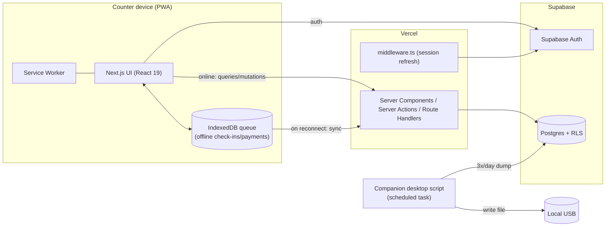

# Tech — Architecture & Technical Implementation

Version: 1.0
Date: 2026-06-11
Companion docs: `PRD.md` (product requirements), `DB.md` (database schema).

This document describes **how** the Gym Management System is built: the stack, the services, and how each requirement in `PRD.md` is implemented technically.

---

## 1. Stack at a glance

| Layer | Choice | Notes |
|---|---|---|
| Framework | **Next.js 15** (App Router) | Full-stack: UI + server actions + route handlers |
| UI runtime | **React 19** | Server Components by default, Client Components where interactivity is needed |
| Language | **TypeScript 5** (strict) | Path alias `@/*` → project root |
| Styling | **Tailwind CSS v4** | Configured via `@tailwindcss/postcss`; CSS variables theme |
| UI components | **shadcn/ui** (`radix-luma` style, base color `zinc`) | Built on `radix-ui`; icons from `lucide-react` |
| Database | **Supabase Postgres** | See `DB.md` |
| Auth | **Supabase Auth** | Username + password via synthetic email mapping |
| Email | **Resend** | Used only for worker password reset |
| Hosting | **Vercel** (app) + **Supabase** (DB/Auth) | |
| Delivery | **PWA** | Installable on Chrome/Edge; offline check-in + payment |
| Backup | **Companion desktop script** | Scheduled dump to USB 3×/day |

### 1.1 Already installed (from `package.json`)

Dependencies:
- `next@^15.5.19`, `react@19.2.4`, `react-dom@19.2.4`
- `@supabase/ssr@^0.10.3`, `@supabase/supabase-js@^2.108.1`
- `radix-ui@^1.5.0`, `lucide-react@^1.17.0`
- `class-variance-authority@^0.7.1`, `clsx@^2.1.1`, `tailwind-merge@^3.6.0`, `tw-animate-css@^1.4.0`
- `resend@^6.12.4`

Dev dependencies:
- `tailwindcss@^4`, `@tailwindcss/postcss@^4`
- `shadcn@^4.11.0`
- `typescript@^5`, `@types/node@^20`, `@types/react@^19`, `@types/react-dom@^19`
- `eslint@^9`, `eslint-config-next@16.2.7`

Already wired in the repo:
- `utils/supabase/server.ts` — server-side Supabase client (cookie-based, for RSC/server actions).
- `utils/supabase/client.ts` — browser Supabase client.
- `utils/supabase/middleware.ts` + root `middleware.ts` — refreshes the auth session on every request (calls `supabase.auth.getUser()`).
- `utils/resend/client.ts` + `utils/resend/send.ts` — Resend client and `sendEmail()` helper.
- `components/ui/button.tsx` — first shadcn primitive; `lib/utils.ts` exposes `cn()`.
- `components.json` — shadcn config (`style: radix-luma`, `baseColor: zinc`, aliases for `@/components`, `@/components/ui`, `@/lib`, `@/hooks`).
- `app/layout.tsx` + `app/globals.css` — root layout and Tailwind v4 theme.

### 1.2 To add during development
- shadcn primitives as needed (pulled via the shadcn MCP per project rule): `input`, `label`, `form`, `dialog`, `select`, `table`, `card`, `badge`, `sidebar`, `sonner`/`toast`, `command` (search), `popover`, `tabs`, `alert-dialog`, `calendar`/date picker.
- `@tanstack/react-query` (server-state caching + optimistic updates for fast check-in).
- A PWA layer: service worker + offline store (see §6). Options: `next-pwa`/`@serwist/next` for the service worker, and **IndexedDB** (via `idb` or `Dexie`) for the offline queue.
- Zod for input validation in server actions/forms.
- The companion backup script (Node) — see §8.

> **UI rule:** always use shadcn/ui primitives from `@/components/ui/*`, pulled/verified via the shadcn MCP, before writing custom UI. Keep styling in Tailwind and reuse shadcn variants.

---

## 2. High-level architecture



- **Rendering**: Server Components fetch data through the server Supabase client; interactive pieces (check-in form, payment dialog, search) are Client Components using React Query for caching and optimistic updates.
- **Mutations**: prefer **Server Actions** for online writes (member CRUD, prices, account management). Check-in and payment writes also go through an offline-aware path (§6) so they can be queued when offline.
- **Session**: the root `middleware.ts` keeps the Supabase auth cookie fresh on every request and is the natural place to enforce route-level auth/role gating.

### 2.1 Proposed folder structure
```
app/
  (auth)/login/                 # login page
  (app)/
    layout.tsx                  # authenticated shell + sidebar
    dashboard/                  # daily check-in
    clanovi/                    # members list + virtual card
    cene/                       # membership prices
    pazar/                      # daily/monthly/yearly takings
    smene/                      # shifts (admin)
    nalozi/                     # accounts (admin)
  api/                          # route handlers (sync endpoint, export, cron)
components/
  ui/                           # shadcn primitives
  <feature components>
lib/
  utils.ts                      # cn() + helpers
  auth/                         # role guards, username<->email mapping
  db/                           # typed queries, server actions
  offline/                      # IndexedDB queue + sync engine
  time/                         # Europe/Belgrade business-day helpers
utils/
  supabase/{server,client,middleware}.ts
  resend/{client,send}.ts
supabase/
  migrations/                   # SQL migrations (see DB.md)
scripts/
  backup-usb.mjs                # companion backup script
```

---

## 3. Authentication & authorization

### 3.1 Username + password (no public email)
- Supabase Auth requires an email identity, so each worker maps to a **synthetic internal email**: `"<username>@gym.local"` (domain is internal, never sent mail).
- Login flow: the UI takes `username` + `password`, the server maps `username → synthetic email`, then calls `supabase.auth.signInWithPassword`.
- A `staff` profile row (see `DB.md`) is linked 1:1 to `auth.users.id` and stores `username`, `role`, `recovery_email`, and `active`.

### 3.2 Password reset (Resend)
- Each `staff` record has a **recovery email** (set by an Admin at creation).
- Reset flow: Admin can issue a reset, or the worker requests one; the app generates a reset token and emails it to the recovery email via the existing `sendEmail()` helper (`utils/resend/send.ts`). The link lands on a "set new password" page that calls Supabase Auth to update the password.
- Requires `RESEND_API_KEY` and `RESEND_FROM_EMAIL` to be configured (see §10).

### 3.3 Roles
- Two roles: `user` and `admin`, stored on the `staff` row.
- **Database-level**: Postgres **RLS** policies enforce access (e.g. only Admins can read monthly/yearly aggregates, manage accounts, or edit past-day logs). RLS reads the caller's role via a helper that joins `auth.uid()` to `staff.role`.
- **App-level**: middleware + layout guards hide/disable Admin-only routes and actions for Users; this is a UX layer on top of (never instead of) RLS.
- **Admin remote view-only**: an Admin logging in away from the counter sees read-only overviews. This session does **not** open a shift (see §5).

---

## 4. Data layer

- **Supabase Postgres** with the schema in `DB.md`. All access goes through RLS-protected tables.
- **Clients**: `utils/supabase/server.ts` for RSC/server actions/route handlers; `utils/supabase/client.ts` for browser-side reads and realtime if needed.
- **Types**: generate TypeScript types from the database (`supabase gen types typescript`) into `lib/db/types.ts` for end-to-end type safety.
- **Migrations**: SQL migrations live in `supabase/migrations/` and are the source of truth for the schema (`DB.md` mirrors them).
- **Query practices** (per the Supabase Postgres best-practices skill): index every foreign key, use partial/composite indexes for hot lookups (member search, daily takings by business date), keep transactions short, and rely on RLS for tenant/role isolation.

---

## 5. Shifts from auth sessions

- A shift is a `shifts` row (`staff_id`, `started_at`, `ended_at`, `ended_reason`).
- **Open a shift** when a worker logs in at the counter (a counter session). **Close it** on logout.
- **Handover ("switch worker")**: a server action closes the current shift (`ended_reason = 'switch'`) and opens a new one for the incoming worker after re-authenticating them — without tearing down the PWA/app state.
- **Safety net**: a scheduled job (Supabase `pg_cron` or a Vercel Cron route handler) auto-closes shifts still open past the configured closing time (`ended_reason = 'auto_close'`); optionally close after N hours of inactivity (`'inactivity'`). This prevents 14-hour phantom shifts from a forgotten logout.
- **Admin remote view-only** logins are flagged as non-counter sessions and **do not create** a shift.

---

## 6. Offline-first (PWA)

Mandatory offline operations: **check-in** and **payment**. Member creation/edits may wait for connectivity.

### 6.1 Service worker
- Installable PWA via a web app manifest + service worker (`@serwist/next` or `next-pwa`).
- The service worker pre-caches the app shell and static assets so the UI loads with no network.
- **Browser support**: Chrome/Edge get full installable-PWA behavior; **Firefox** runs the same app in-browser with working service-worker offline caching, but is **not installable as a standalone app window** — acceptable per product decision.

### 6.2 Offline write queue
- Check-in and payment writes are written **first to IndexedDB** (an append-only outbox) and reflected immediately in the UI (optimistic), then flushed to the server.
- Records use **client-generated UUIDs (UUIDv7)** as primary keys so offline rows have stable IDs and never collide on sync (see `DB.md` §PK strategy). This makes sync **idempotent** (upsert by id).
- The **business day** is derived from the device clock in **Europe/Belgrade** at creation time and stored on the row, so a check-in created offline lands on the correct day after sync.

### 6.3 Sync engine
- On reconnect (and periodically while online), a sync worker drains the IndexedDB outbox to a sync endpoint / server actions, upserting by `id`.
- **Member numbers**: a member created offline gets a temporary `pending` display number; on sync the server assigns the next real `member_no` via a Postgres sequence/trigger (in sync order). The permanent number is then reflected on the card.
- **Conflicts**: writes are mostly additive (new check-ins/payments), minimizing conflicts. For edits, last-write-wins by `updated_at` with the audit trail preserved; same-day-only edit rules for Users are enforced server-side via RLS.

### 6.4 Connectivity UX
- A clear online/offline indicator and a "pending sync (n)" badge.
- Operations outside the offline scope (member create/edit, price changes, account management) are disabled or deferred with a message while offline.

---

## 7. Feature → implementation map

| Feature (PRD) | Implementation |
|---|---|
| Daily check-in dashboard | Server Component for the day's list + Client check-in form; `command`/`popover` for fast member search (name/surname/member_no/phone) |
| Key occupancy (22) | Derived from today's open check-ins; "otišao" sets `key_returned`; shared keys = latest assignment wins |
| Membership status badges | Computed from `memberships` (active/expired/paused/none); red "istekla članarina" marker |
| Trainer session + session deduction | Check-in writes `with_trainer`, `training_type`, `trainer_id`; transaction decrements `sessions_left` and inserts a `session_logs` row |
| Reserved (owed) session | Insert `reserved_sessions` with the **captured daily price**; warn after 3; settle at next payment |
| Payments / custom price / discount | Payment dialog with confirmation for custom price (< standard, > 0) + optional reason; auto reduced price list for discount-flagged members on Open type |
| Takings ("pazar") | Aggregations by business date; net of voided payments; monthly/yearly views gated to Admin via RLS |
| Payment void + membership revert | Transaction marks payment voided and reverts the linked membership change |
| Prices admin | CRUD on `prices`/`membership_types`, Admin-only |
| Shifts | See §5 |
| Soon-to-expire (≤3 days) | Query memberships with `end_date <= today + 3` |
| Reports export (Admin) | Route handler streams CSV/JSON of the selected report |
| Notifications | In-app only via toasts/badges (`sonner`); no email/SMS to members |

---

## 8. Backup to USB

- A **companion Node script** (`scripts/backup-usb.mjs`) runs on the counter computer via a **Windows Task Scheduler** job **3× per day**.
- It produces a **full database dump** and writes it to the mounted USB path. Two viable approaches:
  - `pg_dump` against the Supabase Postgres connection string (richest, restorable SQL), or
  - a Supabase **service-role** client that exports all tables to JSON/CSV when `pg_dump` isn't available on the machine.
- Files are timestamped and rotated; Supabase cloud remains the primary durable copy.
- The script uses a **service-role key** kept **only on the local machine** (never shipped to the browser).
- Dataset is small (~1,000 members) so dumps are quick.

---

## 9. Hosting & deployment

- **App** on **Vercel** (Next.js native). **DB/Auth** on **Supabase**.
- **Cron**: shift auto-close and any periodic tasks via Vercel Cron (route handler) or Supabase `pg_cron`.
- Migrations applied through the Supabase CLI; types regenerated after each migration.

---

## 10. Environment variables

| Variable | Used by | Purpose |
|---|---|---|
| `NEXT_PUBLIC_SUPABASE_URL` | client/server/middleware | Supabase project URL |
| `NEXT_PUBLIC_SUPABASE_PUBLISHABLE_KEY` | client/server/middleware | Public (anon/publishable) key |
| `SUPABASE_SERVICE_ROLE_KEY` | backup script, admin server tasks | Privileged operations (server/local only) |
| `RESEND_API_KEY` | `utils/resend/client.ts` | Send password-reset emails |
| `RESEND_FROM_EMAIL` | `utils/resend/client.ts` | From address (defaults to `onboarding@resend.dev`) |

> The existing helpers read `NEXT_PUBLIC_SUPABASE_URL` and `NEXT_PUBLIC_SUPABASE_PUBLISHABLE_KEY`. Keep those names. Never expose the service-role key to the browser.

---

## 11. Non-functional implementation notes
- **Performance**: React Query caching + indexed search columns keep check-in/search at a couple of seconds for ~1,000 members.
- **Security**: RLS is the primary guard; app guards are UX only. Service-role key stays server/local-side.
- **Audit**: `created_by`/`updated_by` + `created_at`/`updated_at` on mutable tables; past-day edits restricted to Admins by RLS.
- **i18n/format**: Serbian latinica strings; RSD currency formatting; all timestamps stored as `timestamptz`, business day computed in `Europe/Belgrade`.
- **Quality**: ESLint (`eslint-config-next`), TypeScript strict, Zod validation at the server boundary.

---

## 12. Phased delivery (maps to SoW)
- **Phase 0 — Setup**: schema + RLS, auth (username/password, seed 2 Admins), app shell + sidebar (shadcn).
- **Phase 1 — Core (MVP)**: members CRUD + card + search; membership types/prices; dashboard check-in + keys + day navigation; cash payment + custom price + discount list + daily takings.
- **Phase 2 — Advanced**: trainer sessions + session deduction + card history; reserved/owed sessions + settlement; pause/resume; Fitpass + surcharge; key search; shifts + Admin views; monthly/yearly takings; soon-to-expire list; Admin export.
- **Phase 3 — Reliability**: PWA + offline check-in/payment + sync; automatic USB backup 3×/day.
