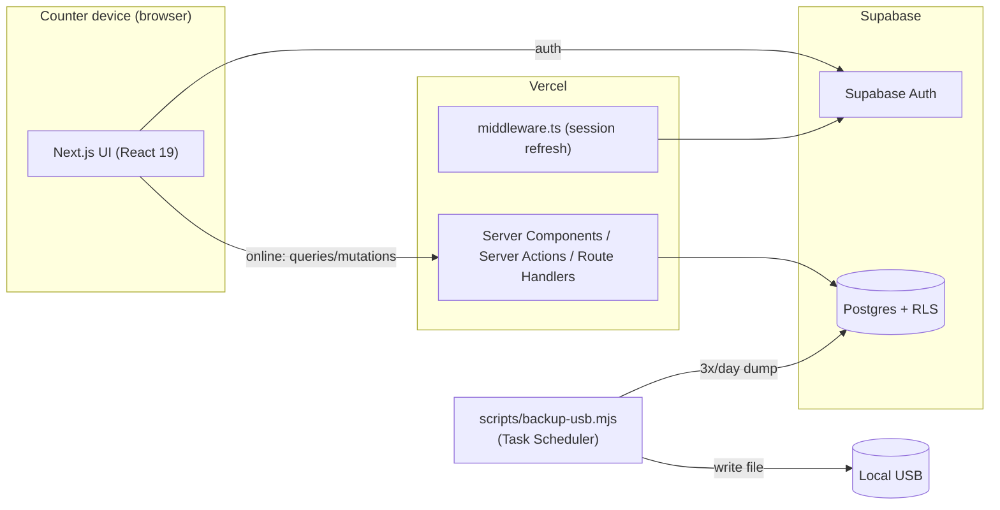

# Tech — Architecture & Technical Implementation

Version: 1.26
Date: 2026-06-25
Companion docs: `PRD.md` (product requirements), `DB.md` (database schema).

This document describes **how** the Gym Management System is built: the stack, the services, and how each requirement in `PRD.md` is implemented technically.

> v1.1 records the implemented **Members ("Članovi")** feature (list + fuzzy search + virtual card + create/edit/archive) under `(app)/clanovi`, the supporting `lib/members/` and `lib/time/` helpers, and the member-search migrations (mirrored in `DB.md` §9). See §2.1, §7, and §12.
> v1.2 records the implemented **Dashboard (daily check-in)** under `(app)/dashboard`, `lib/dashboard/`, Postgres RPCs `create_checkin` / `void_checkin` (`DB.md` §10), the `training_category` refactor on `/cene`, session/auth deduplication (`lib/supabase/server-client.ts`, `React.cache()` + `getUser()` in server components), migration `20260615140000_dashboard_support` (applied remotely as `dashboard_support`), and member-search cleanup migrations `20260615200000` / `20260615210000` (no phone; single RPC overload).
> v1.3 records the implemented **Pazar / payment MVP**: `(app)/pazar`, `lib/pazar/`, shared `components/payment/payment-dialog.tsx`, Postgres RPCs `record_payment` / `void_payment` / `promote_memberships` (`DB.md` §8.2, §11), group Fitpass +300 in `create_checkin`, payment entry points on dashboard + member card, Admin CSV export (`/api/admin/pazar/export`). Migrations `20260617100000`–`20260617100400`.
> v1.4 records **Phase 0 auth/shift hardening**: shift lifecycle via Postgres RPCs `ensure_open_shift()` / `end_shift()` (`DB.md` §12); counter hard-fail guards in `lib/shifts/actions.ts`; password reset SSR callback (`app/auth/callback/route.ts` — `verifyOtp` + `token_hash`, not implicit `action_link`); middleware `GUEST_ONLY` vs public auth paths; `login_attempt` pg_cron cleanup (`DB.md` §8.3). Migrations `20260617100500`, `20260617100600`.
> v1.5 records **Phase 0 shift attribution (fail-open)**: `open_or_resume_shift()` / `handover_shift()` / INVOKER `end_shift()`; `shift_id` + waive on `checkin`/`payment`; counter banner + admin reconcile (`?unassigned=1`); deploy runbook `npm run auth:push-config`. Migration `20260617100700_shift_attribution`.
> v1.6 records the **first production deployment** (Vercel project `gym-management-system` → `https://gym-management-system-five-ashy.vercel.app`, Supabase `qkmrssvfeljfkqbbxfpr`) and the **migration-ledger reconcile** (MCP-applied versions re-aligned to repo files via `db reset` + `migration repair`). Adds the localhost guard in `push-supabase-auth-config.mjs`, `vercel.json` `fra1` region, the `supabase` CLI devDependency, and the **deployment incidents & lessons** in §9. Phase 0 smoke (auth reset, shift attribution, admin reconcile) verified live on 2026-06-18.
> v1.7 records **Phase 0 security hardening** (2026-06-18, applied live): (1) `handle_new_user` no longer trusts client-suppliable `role` metadata — admin role granted via explicit service-role update in `accounts/route.ts` + `seed-admins.mjs` (§3.3); (2) Auth config `disable_signup` + `password_min_length=8` pushed via `push-supabase-auth-config.mjs` (leaked-password/HIBP gated behind `ENABLE_HIBP` — Pro plan; §10), and `site_url` precedence fixed to prefer the inline env var; (3) `open_or_resume_shift()` → `SECURITY DEFINER`, `shift_select_open` policy dropped (§5; `DB.md` §12.1); (4) login rate-limit gains a per-username global cap alongside username+IP (§3.1); (5) `rls_auto_enable()` RPC execute revoked. New helper `scripts/set-admin-password.mjs` for service-role password rotation. Schema deltas in `DB.md` v1.9 (migrations `20260618120000`–`20260618120200`).
> v1.8 records **Phase 1a Members fixes** (2026-06-18): phone is now **unique** (DB constraint `member_phone_digits_uidx`; the duplicate-phone soft warning and `checkPhoneDuplicate` server action are removed, the `23505` violation mapped to a friendly error in `clanovi/actions.ts`); the member card adds an **"Istorija članarina"** section and shows **"Istekla"** for an expired latest membership; the members list shows "Istekla" too via the recreated `search_members` (§7). Schema deltas in `DB.md` v1.10 (migrations `20260618130000`–`20260618131000`, applied via `supabase db push`).
> v1.9 records **Phase 1a Members review closure** (2026-06-18): **restore (unarchive) is DB-enforced** via `member_restore_admin_guard` / `enforce_member_restore_admin()` (`DB.md` §3.3, §5.1); app `requireAdmin()` on `restoreMember` remains defense-in-depth. Custom price is per-payment and intentionally shown only in payment history, not as a card field (PRD §3.3). Migration `20260618132000`, applied via `supabase db push`.
> v1.11 records **Phase 0 review follow-ups** (2026-06-18, doc + minor UI; no schema/behaviour change): (1) the `/dashboard` nav label and page title are now **„Kontrolna tabla"** in code (`lib/nav.ts`), matching §12; (2) §9 deploy runbook step 4 (`npm run auth:push-config`) is marked **mandatory** — the script sets `mailer_otp_exp=3600`, so the reset email's „Link važi 1 sat" promise stays true (it also pushes `disable_signup`/`password_min_length` and refuses a localhost `site_url`); (3) §3.4 documents the **accepted risk** of the constant `gym_counter` cookie payload (`"1"`).
> v1.10 records **Phase 0 alignment production deploy** (2026-06-18, commit `c0fd532` on `main`): (1) shell routes under `app/(app)/(shell)/` with access gate — workers off-counter redirect to `/samo-salter` (no sidebar); (2) generic auth error for wrong password **and** disabled accounts (`GENERIC_AUTH_ERROR`); (3) shared rate limiting in `lib/auth/rate-limit.ts` for login, forgot-password, and switch-worker flows; (4) **last-active-admin guard** in `app/api/admin/accounts/route.ts` + disabled controls in `accounts-table.tsx` (disable / demote blocked when ≤1 active admin); (5) counter logout prompts **Završi smenu** when `has_open_shift()` is true (`hasOpenShiftAction()` → `DB.md` §12.3a, migration `20260618140000`); (6) admin account creation requires recovery email. Deploy: `git push origin main` → Vercel auto-deploy; `supabase db push` was a **no-op** (ledger already 1:1, 31/31 applied). Smoke verified live — §9.2. **Never** use MCP `apply_migration` for remote schema (§9).
> v1.12 records **Phase 1a Members review follow-ups** (2026-06-18, commit `cc33661` on `main`): four minor cleanups on the members feature — (1) the member card „Trenutna članarina" panel now shows **„Datum uplate"** (the linked `payment.business_date`, fallback `membership.created_at`); (2) the member card RSC reads via cached **`getServerSupabase()`** (`React.cache()`) instead of an uncached `createClient` (§2.1); (3) **archive-debt DB guard** — trigger `member_archive_no_debt_guard` blocks archiving while unsettled `reserved_session` exist, backstopping the app pre-check in `clanovi/actions.ts` (`DB.md` §3.3/§5.1, v1.13); (4) removed the unused `normalizePhone` helper (phone uniqueness is DB-enforced). Schema delta in `DB.md` v1.13 (migration `20260618184915`). **Ledger caveat:** this migration was applied via MCP `apply_migration` (local CLI not linked, so `db push` was unavailable) against the documented preference; the repo file was renamed to the MCP-stamped version `20260618184915` to keep the ledger 1:1.
> v1.13 records **Phase 1b Cene review follow-ups** (2026-06-19, code-only cleanup; **no schema change**, no behaviour change beyond one error message): (1) new shared catalog sort `lib/catalog/sort.ts` (`sortMembershipTypes` / `compareMembershipType`) orders packages by session count with time-based (30/1) last, applied in both `cene/page.tsx` and `lib/pazar/catalog.ts` (§2.1) — replaces lexicographic `.order("package")` that put "8/1" after "30/1"; (2) `/cene` and `/nalozi` RSC pages now read via cached **`getServerSupabase()`** instead of an uncached `createClient` (§2.1, same convention as the member card); (3) removed unused catalog server actions `updateMembershipType` / `updateTrainingCategory` / standalone `createTrainingCategory` and their zod schemas/types from `lib/catalog/schema.ts` (no UI consumers; category creation stays in `createMembershipType`'s `new_category` branch); (4) new-category creation now returns readable Serbian errors — „Naziv kategorije mora sadržati slova ili brojeve." for an empty slug and „Kategorija sa ovim nazivom već postoji." for a duplicate `code` (pre-check + `23505` backstop) instead of a raw Postgres message. See `DB.md` v1.14.
> v1.14 records **Phase 1c Dashboard review follow-ups** (2026-06-19; migration `20260619120000_checkin_trainer_no_package`, `create or replace` on `create_checkin` / `void_checkin` — **no table/RLS change**, RPC signature unchanged so **no type regen**): (1) **trainer session without an active trainer-based package** (PRD §3.5) — `create_checkin` is unified **by training category** (deduct only from the same-category active package with sessions; otherwise `reserved_session`; `checkin.membership_id` = same-category active membership or `null`; `GYM01`/`GYM02` SQLSTATEs — `DB.md` §10.2); `void_checkin` first-visit revert is now member-scoped (§10.3); (2) **dashboard UI** (`checkin-dialog.tsx`): trainer tick is offered to **all** members; when there is no active trainer-based membership (S0/S3) the worker picks the category from a new server-filtered list (`fetchTrainerCheckinCategories` — only `is_trainer_based` categories with an active `sessions=1` price), **no preselect**, with a passive „Poslednji put" hint (`lastTrainerCategoryId`); an active **non-trainer** membership (S3) prompts a confirm before the debt; the comment popup now fires on **dialog open**; category resolution is server-authoritative in `dashboard/actions.ts` (S1/S2 fixed to the membership, S0/S3 validated against the list); (3) **P4** `fetchSoonToExpire` adds `.gte("end_date", today)` so already-expired memberships drop out of „uskoro ističe"; (4) **P6** the dashboard `metadata.title` is centralised from `lib/nav.ts` (`getPageTitle`). The payment-badge dedup (P5) and the paused-membership session rule (Phase 2) are intentionally **not** in this round. **Follow-up regression fix** (migration `20260619130000`): the v1.14 `create_checkin` rewrite dropped the `shift_id` assignment from `20260617100700` (§5 / `DB.md` §12.4); restored so check-ins and the group-Fitpass payment are attributed to the caller's open shift again (`DB.md` v1.16). See `DB.md` v1.15–v1.16 / PRD v1.11.
> v1.15 records **Payment ↔ Check-in veza — Etapa 1** (2026-06-19; migration `20260619140000_payment_checkin_link`): adds **`payment.checkin_id`** so a charge can be tied to the arrival that generated it (§2.3/§2.4). (1) **M1 fix** — `void_checkin` now reverses the group-Fitpass **+300 `fitpass_surcharge`** charge it could not previously reach, so voiding a group Fitpass arrival no longer leaves +300 in the day's takings (two-stage match: `payment.checkin_id` FK → exact-key fallback `business_date`+`staff_id`+`created_at` for legacy rows; only `kind='fitpass_surcharge'`, **never** a membership; an ambiguous fallback warns and skips, the check-in still voids). (2) **m2** — the dashboard surcharge badge renders **per check-in** (`fetchDayCheckins` adds a `checkin_id` lookup, with the same exact-key fallback, so the group-Fitpass row shows its +300). (3) `record_payment` accepts `p_checkin_id` on the **membership** payment. Type regen touches only `payment` Row/Insert/Update + the new FK ([[db-types-custom-aliases]] preserved). See `DB.md` v1.17 / PRD v1.12–v1.13.
> v1.16 aligns **§9 / §2.3 / §2.4 / §12** with the codebase (2026-06-19): `PaymentDialog` already forwards `checkinId` when the entry point supplies it (arrivals-row "Naplati" → `payment.checkin_id`; search / member card / pre-check-in dialog pass `null`). Etapa 2 remainder: pay-after-check-in link from the check-in dialog. Repo: **35** migrations; `lib/offline/` not yet created; `scripts/verify_payment_checkin_link.sql` added. See `PRD.md` §9 / `DB.md` v1.17.
> v1.17 records **Admin Smene history UI** (2026-06-19; **no schema change**, `supabase db push` no-op): `(app)/(shell)/smene` — weekly shift history for Admins (`requireAdmin()` in layout; remote Admin without counter cookie included). URL: canonical `?date=` (defaults to Belgrade today; week = Mon–Sun containing that date); optional `?staff=` worker filter persists across date changes. Data: `fetchShiftHistory()` in `lib/shifts/queries.ts` (interval-overlap query on `shift`, grouped by Belgrade calendar day of `started_at`; worker day summaries; `nextStartedAtSameDay`; coverage gaps vs `[09:00, close]` with 5 min threshold and today capped at `min(now, close)`). Helpers: `lib/shifts/format.ts`, `lib/time/business-day.ts` (`belgradeDayOf`, `belgradeInstant`, `weekStartMonday`, `addDays`). UI: `date-nav.tsx` (±7 days), `worker-filter.tsx`, `smene-client.tsx` (table + mobile cards). Export: `GET /api/admin/smene/export?date=&staff=` → `smene-<weekStart>.csv`. RLS: `shift SELECT = is_admin()` — authenticated cookie client only, no service-role. See `DB.md` v1.18 / PRD v1.14.
> v1.18 records **Payment ↔ Check-in link — Etapa 2 complete** (2026-06-22; **no schema change**): (1) **check-in dialog UI** — after successful `createMemberCheckin` the dialog stays open (multi check-in per day); `lastCheckinId` drives "Naplati članarinu"; opening payment closes the check-in dialog (`dashboard-counter.tsx`). (2) **App-layer auto-link** — `lib/dashboard/payment-checkin-link.ts`: **`linkOrphanPaymentToCheckin`** after `createMemberCheckin` (pay-first flow); **`resolveCheckinIdForPayment`** before `record_payment` (check-in-first flow when UI passes `null`). Scope: same `member_id` + `business_date`; explicit `checkinId` from arrivals row or post-confirm dialog wins; ~1:1 heuristic (latest orphan payment ↔ latest check-in without a linked membership payment). Guarded by `requireCounterToday()`; payment UPDATE allowed by RLS for today's rows. No partial unique index on membership↔checkin (unlike `fitpass_surcharge`). See `DB.md` v1.19 / PRD v1.15.
> v1.19 records **Pause / resume membership** (2026-06-22; migration `20260622120000_pause_resume_membership`): RPCs `pause_membership` / `resume_membership` (`DB.md` §11.4); member-card `MembershipPauseControls`; dashboard member-level paused lookup in `fetchDayCheckins` (amber „Pauzirana članarina" badge — current state, not historical per arrival); check-in dialog paused warning + suppressed reserved/debt UX; `create_checkin` paused branch in `DB.md` §10.2. Verification: `scripts/verify_pause_resume.sql`. See `DB.md` v1.20 / PRD v1.16.
> v1.20 records **check-in dialog UX fix + deferred duplicate guard** (2026-06-22; **no schema change**): `checkin-dialog.tsx` now **closes after every successful** `createMemberCheckin` (supersedes v1.18 stay-open / `lastCheckinId` post-confirm pay path — pay-after-check-in is via arrivals-row **Naplati** only). PRD §9.2 adds **duplicate check-in while member still present** as pre-launch polish. See `PRD.md` v1.17.
> v1.21 records **open-visit guard (GYM05) + key-number search** (2026-06-22; migration `20260622130000_open_visit_guard`, `create or replace` on `create_checkin` — **signature unchanged**, no type regen): (1) **GYM05** — server hard-block when member has open visit today; passive amber hints in `checkin-search.tsx` (badge per row) and `checkin-dialog.tsx` (`hasOpenVisit` / `openVisitKeyNo` from `fetchCheckinMemberContext`); confirm button stays enabled (toast on submit). (2) **Key search** — `keys-panel.tsx` input + `findLastKeyHolder` (`requireUser()`, not counter-only); `fetchLastKeyHolder` / `fetchOpenVisitsForMembers` in `lib/dashboard/queries.ts`. Verification: `scripts/verify_open_visit_guard.sql`. See `DB.md` v1.21 / PRD v1.18.
> v1.22 records **solo Otvoreni auto session deduction** (2026-06-22; migration `20260622140000_open_solo_session_deduct`, `create or replace` on `create_checkin` — **signature unchanged**, no type regen): solo arrival on active session-based Otvoreni (`training_category.code='otvoreni'`, `is_time_based=false`) decrements `sessions_left` without trainer tick or `session_log`; 0 sessions → check-in without deduction; `createMemberCheckin` refetches context post-RPC for toast state; `checkin-dialog.tsx` passive hints + last-session toast. Verification: `scripts/verify_open_solo_session.sql`. See `DB.md` v1.22 / PRD v1.19.
> v1.23 records **Phase 2 dashboard closure** (2026-06-23): (1) **Unreturned keys** — `fetchUnreturnedKeys(businessDate)` + keys panel „Nevraćeni ključevi" (count badge, holder/time/worker, `isPastGymClosing` via `lib/dashboard/closing.ts`); (2) **Session override after expiry** — migration `20260623140000`, `p_allow_expired_override` on `create_checkin`; `fetchCheckinMemberContext.expiredPackages`; override confirm in `checkin-dialog.tsx`; authoritative post-RPC `fetchCheckinSubmitResult`; search badge „Istekla — preostalo {n} sesija". Verification: `scripts/verify_session_override.sql`. See `PRD.md` v1.20 / `DB.md` v1.23.
> v1.24 records **Phase 3 — PWA + offline + USB backup** (2026-06-25): `@serwist/next` + `serwist` + `idb`; `lib/offline/` (IndexedDB cache/outbox, main-thread `sync.ts`, `useOfflineSync`, submit wrappers); counter-only offline check-in/payment with optimistic UI + chronological drain via existing server actions; migration `20260625120000` adds **`p_id`** idempotency on `create_checkin` / `record_payment`; kill switch **`NEXT_PUBLIC_OFFLINE_ENABLED`**; `GET /api/health`; `scripts/backup-usb.mjs`; verification `scripts/verify_offline_idempotency.sql`. Repo: **40** migrations. See `PRD.md` v1.21 / `DB.md` v1.24.
> v1.25 records **Phase 3 rollback — online-only counter** (2026-06-25): removed PWA/offline layer (`lib/offline/`, `@serwist/next`, `serwist`, `idb`, service worker, connectivity UI, Playwright offline e2e). Dashboard check-in/payment use **direct server actions** only. **`scripts/backup-usb.mjs` retained**; cloud backup = ops plan (not app code). DB `p_id` migration **not reverted**. Delivery: standard web app (Chrome/Edge/Firefox). See `PRD.md` v1.22 / `DB.md` v1.25.
> v1.26 records **Phase 3 DB rollback — revert offline `p_id`** (2026-06-25): migration `20260625160000_revert_offline_p_id` restores `create_checkin` / `record_payment` without `p_id`; app schemas/actions no longer send client ids. **No table/data changes.** Repo: **41** migrations. See `PRD.md` v1.23 / `DB.md` v1.26.

---

## 1. Stack at a glance

| Layer | Choice | Notes |
|---|---|---|
| Framework | **Next.js 15** (App Router) | Full-stack: UI + server actions + route handlers |
| UI runtime | **React 19** | Server Components by default, Client Components where interactivity is needed |
| Language | **TypeScript 5** (strict) | Path alias `@/*` → project root |
| Styling | **Tailwind CSS v4** | Configured via `@tailwindcss/postcss`; CSS variables theme |
| UI components | **shadcn/ui** (`radix-luma` style, base color `zinc`) | Built on `radix-ui`; icons from `lucide-react` |
| Database | **Supabase Postgres** | See `DB.md` |
| Auth | **Supabase Auth** | Username + password via synthetic email mapping |
| Email | **Resend** | Used only for worker password reset |
| Hosting | **Vercel** (app) + **Supabase** (DB/Auth) | |
| Delivery | **Web app** | Chrome / Edge / Firefox on the counter PC (online-only) |
| Backup | **Companion desktop script** | Scheduled dump to USB 3×/day |

### 1.1 Already installed (from `package.json`)

Dependencies:
- `next@^15.5.19`, `react@19.2.4`, `react-dom@19.2.4`
- `@supabase/ssr@^0.10.3`, `@supabase/supabase-js@^2.108.1`
- `radix-ui@^1.5.0`, `lucide-react@^1.17.0`
- `class-variance-authority@^0.7.1`, `clsx@^2.1.1`, `tailwind-merge@^3.6.0`, `tw-animate-css@^1.4.0`
- `resend@^6.12.4`

Dev dependencies:
- `tailwindcss@^4`, `@tailwindcss/postcss@^4`
- `shadcn@^4.11.0`
- `typescript@^5`, `@types/node@^20`, `@types/react@^19`, `@types/react-dom@^19`
- `eslint@^9`, `eslint-config-next@16.2.7`

Already wired in the repo:
- `utils/supabase/server.ts` — server-side Supabase client (cookie-based, for RSC/server actions).
- `utils/supabase/client.ts` — browser Supabase client.
- `utils/supabase/middleware.ts` + root `middleware.ts` — refreshes the auth session on every HTTP request (`supabase.auth.getUser()` once in middleware).
- `lib/supabase/server-client.ts` — cached Supabase server client per RSC request (`React.cache()`).
- `utils/resend/client.ts` + `utils/resend/send.ts` — Resend client and `sendEmail()` helper.
- `components/ui/button.tsx` — first shadcn primitive; `lib/utils.ts` exposes `cn()`.
- `components.json` — shadcn config (`style: radix-luma`, `baseColor: zinc`, aliases for `@/components`, `@/components/ui`, `@/lib`, `@/hooks`).
- `app/layout.tsx` + `app/globals.css` — root layout and Tailwind v4 theme.

### 1.2 Installed UI & libraries
- shadcn primitives: `input`, `label`, `form`, `card`, `sonner`, `alert-dialog`, `dialog`, `dropdown-menu`, `table`, `badge`, `switch`, `separator`, `select`, `textarea`, `sidebar`, `sheet`, `tooltip`, `skeleton`, **`command`**, **`popover`**, **`checkbox`**, **`tabs`**, `input-group` (dashboard search + Fitpass/check-in dialogs; cene tabs).
- **Zod**, **react-hook-form**, **@hookform/resolvers** — auth and member forms.

### 1.3 Optional / not used
- **`@tanstack/react-query`** — not installed; dashboard uses `router.refresh()` + server actions.

> **UI rule:** always use shadcn/ui primitives from `@/components/ui/*`, pulled/verified via the shadcn MCP, before writing custom UI. Keep styling in Tailwind and reuse shadcn variants.

---

## 2. High-level architecture



- **Rendering**: Server Components fetch data through the cached server Supabase client; interactive dashboard pieces (search, dialogs, table actions) are Client Components.
- **Mutations**: **Server Actions** for online writes. Check-in mutations call Postgres RPCs (`create_checkin`, `void_checkin`) for atomic side effects (session deduction, reserved debt, first-visit activation).
- **Session**: `middleware.ts` calls `getUser()` once per HTTP request to refresh/validate the JWT cookie. Server Components call cached `getUser()` via `lib/auth/session.ts` (one Auth API call per render tree). See §3.5.

### 2.1 Proposed folder structure
```
app/
  (auth)/                       # unauthenticated shell (implemented)
    login/                      # login page + form + signIn action
    zaboravljena-lozinka/       # forgot password (request reset by username)
    reset/                      # set new password (consumes recovery link)
  auth/
    callback/route.ts           # SSR auth callback (PKCE code + token_hash recovery)
  (app)/
    layout.tsx                  # authenticated shell + sidebar (implemented)
    dashboard/                  # daily check-in (implemented)
      page.tsx                  # server fetch, counter vs remote branch
      actions.ts                # check-in, Fitpass, otišao, key update, void
      dashboard-counter.tsx     # operativni layout (counter + today)
      dashboard-overview.tsx    # remote admin read-only
      date-nav.tsx              # ?date= navigacija
      checkin-search.tsx        # Command combobox + Novi član + Fitpass
      checkin-dialog.tsx        # ključ, trener sesija, komentar popup
      fitpass-dialog.tsx
      arrivals-table.tsx
      keys-panel.tsx
      soon-expire-badge.tsx
    clanovi/                    # members list + search + create dialog (implemented)
      [id]/                     # virtual card: status, quick edits, membership, history, archive (implemented)
    cene/                       # membership prices (implemented: tabbed catalog, inline price edit)
      actions.ts, cene-client.tsx, price-cell.tsx, add-type-dialog.tsx
    pazar/                      # daily takings + Admin month/year (implemented)
      actions.ts, page.tsx, pazar-client.tsx, date-nav.tsx, takings-tabs.tsx, payment-row-actions.tsx
    smene/                      # Admin shift history (implemented: weekly view, filter, CSV)
      layout.tsx                # requireAdmin()
      page.tsx, date-nav.tsx, worker-filter.tsx, smene-client.tsx
    nalozi/                     # accounts (admin) + counter-device toggle (implemented)
  api/
    admin/accounts/             # service-role account management (implemented)
    admin/pazar/export/         # Admin CSV export for takings (implemented)
    admin/smene/export/         # Admin CSV export for shift history (implemented)
components/
  ui/                           # shadcn primitives
  payment/payment-dialog.tsx    # shared cash-payment dialog (implemented)
  app-sidebar.tsx, app-header.tsx, switch-worker-dialog.tsx, counter-device-toggle.tsx, placeholder-page.tsx  # (implemented)
lib/
  utils.ts                      # cn() + helpers
  nav.ts                        # sidebar nav items + active-state + page titles (implemented)
  auth/                         # session/role guards, username<->email, counter cookie, password reset (implemented)
  shifts/                       # shift lifecycle + history queries (implemented)
  members/                      # member zod schema, status derivation, types, formatting (implemented)
  catalog/                      # membership catalog view-models (implemented)
  dashboard/                    # dashboard queries, zod schemas, format (implemented)
  pazar/                        # payment queries, catalog, zod schemas, format (implemented)
  supabase/
    server-client.ts            # cached getServerSupabase() per RSC request (implemented)
  db/                           # typed queries + generated types (lib/db/types.ts)
  time/                         # Europe/Belgrade business-day helpers (implemented: business-day.ts — belgradeDayOf, belgradeInstant, weekStartMonday, addDays)
utils/
  supabase/{server,client,middleware,admin}.ts
  resend/{client,send}.ts
supabase/
  migrations/                   # SQL migrations (40 files as of 2026-06-25; see DB.md)
scripts/
  seed-admins.mjs               # one-time admin seed (implemented)
  push-supabase-auth-config.mjs # optional: push Auth redirect URLs via Management API (needs SUPABASE_ACCESS_TOKEN)
  set-admin-password.mjs        # service-role password rotation (implemented)
  verify_payment_checkin_link.sql # post-migration verification for payment.checkin_id (implemented)
  backup-usb.mjs                # companion USB backup script (Phase 3; schedule via Task Scheduler)
```

### 2.2 Training categories (`training_category`)
The former `training_type` Postgres enum is replaced by a **`training_category` lookup table** so Admins can add categories at runtime (`DB.md` §3.4, migration `20260615120000_training_category_refactor`). Each row carries:
- **`is_trainer_based`**: when true, check-in with a trainer deducts a session and requires a trainer selection.
- **`per_trainee`**: duo-style pricing (amount charged per trainee).
- **`active` + `sort_order`**: soft-deactivate hides from workers; tab order on `/cene`.

`membership_type` references `training_category_id` (unique per `(category, package)`). Billing model (time-based vs session-based) stays on `membership_type.is_time_based`. Discount prices remain tied to the `otvoreni` category code.

### 2.3 Dashboard (daily check-in)
Implemented at `(app)/dashboard` with data helpers in `lib/dashboard/`.

**Display modes** (`page.tsx` branches on `isCounterDevice()` + role + `?date=`):
| Mode | Condition | UI |
|---|---|---|
| **Operativni** | Counter cookie + today's business date | Full check-in: search, dialogs, keys panel, table actions |
| **Read-only worker** | No counter cookie, any date | Same layout minus mutations; amber banner |
| **Remote admin overview** | Admin + no counter cookie | `dashboard-overview.tsx`: day stats, arrivals list, link to `/pazar` |

**Data** (`lib/dashboard/queries.ts`):
- `fetchDayCheckins(businessDate)` — arrivals for the day (excludes voided), enriches with member + membership status + read-only payment badge for today. The group-Fitpass **+300 surcharge badge** is resolved **per check-in** (v1.15): a `fitpass_surcharge` lookup keyed on `payment.checkin_id`, with an exact-key fallback (`staff_id`+`created_at`) for legacy rows, so the anonymous group-Fitpass row (`member_id` null) shows its charge. **Paused marker** (v1.19): a member-level lookup (`membership.status='pauzirana'`) sets `membershipPaused` on each row — current state for today's counter view (not historical per arrival).
- `fetchKeyOccupancy(businessDate)` — open keys (`not key_returned`, `not voided`) with last holder.
- `fetchOpenVisitsForMembers(memberIds, businessDate)` — batch open-visit lookup for search badges (v1.21).
- `fetchLastKeyHolder(keyNo)` — last non-voided holder of a key ever (v1.21; incl. Fitpass).
- `fetchCheckinMemberContext(memberId)` — member + membership + open-visit hint (`hasOpenVisit`, `openVisitKeyNo`, v1.21) + `isSessionBasedOpen` (v1.22).
- `fetchSoonToExpire()` — memberships ending within 3 days.
- `fetchDayStats(businessDate, keyHolders?)` — counts for admin overview.

**Mutations** (`dashboard/actions.ts`): counter mutations guarded by `requireCounterToday()` (counter device + today). Call Postgres RPCs for atomic side effects:
- `createMemberCheckin` → `create_checkin`; then **`linkOrphanPaymentToCheckin`** (Etapa 2, v1.18) when a same-day orphan membership payment exists
- `createFitpassCheckin` → `create_checkin` (`is_fitpass`, optional `is_group_fitpass` — group inserts +300 RSD payment)
- `markLeft` → `key_returned` update
- `updateCheckinKey` → key reassignment on today's open check-in
- `voidCheckin` → `void_checkin` (also reverses the linked group-Fitpass +300 `fitpass_surcharge`, v1.15)

**Read actions** (v1.21): `searchMembersForCheckin` (counter-only) enriches member search with open-visit badges; `findLastKeyHolder(keyNo)` for keys-panel history search (`requireUser()` — remote Admin + off-counter read-only).

**Payment ↔ check-in linking** (`lib/dashboard/payment-checkin-link.ts`, v1.18): all counter paths converge on `payment.checkin_id` for same member + business day. Explicit `checkinId` from UI is used when supplied; otherwise **`resolveCheckinIdForPayment`** picks the latest check-in without a linked membership payment before `record_payment`, and **`linkOrphanPaymentToCheckin`** attaches the latest orphan membership payment after `createMemberCheckin`.

**Payment entry points** (shared `PaymentDialog` → `pazar/actions.recordPayment`; optional `checkinId` → `p_checkin_id`, auto-resolved when omitted):

| Entry point | `checkinId` from UI | Effective link |
|---|---|---|
| `arrivals-table` — row "Naplati" | **yes** (`row.id`) | Explicit |
| `checkin-dialog` — "Naplati članarinu" | `null` | Auto-resolved if same-day check-in exists; pay-first via search path |
| `checkin-search` — "Naplati" | `null` | Auto on next `createMemberCheckin`, or auto-resolved if check-in already exists |
| Member card — `MemberPayButton` | `null` | Auto-resolved if same-day check-in exists; else orphan until check-in |

**UI pieces**: `checkin-search` (shadcn `command`/`popover`, open-visit badge per row, **expired-with-sessions badge**, quick-create member via `CreateMemberDialog.onCreated`), `checkin-dialog` (closes on successful confirm; key, trainer tick offered to all members; fixed category for an active trainer-based package, otherwise a server-filtered manual category select with a „Poslednji put" hint; trainer select; comment popup on open; **expired-session override confirm**; S3 confirm; paused + open-visit warnings; reserved-session warn ≥3; **direct `createMemberCheckin` server action**), `fitpass-dialog`, `arrivals-table`, `keys-panel` (today occupancy + key-number history search + **unreturned-keys report**, v1.23), `date-nav`, `soon-expire-badge`.

### 2.4 Pazar (daily takings & cash payment)
Implemented at `(app)/pazar` with helpers in `lib/pazar/` and shared UI in `components/payment/payment-dialog.tsx`.

**Page** (`page.tsx`):
- Parses `?date=` (default today) and `?view=day|month|year` (Admin only).
- Workers: date limited to today and past; storno/edit on today's rows only.
- Fetches `fetchDayPayments`; Admin month/year via `fetchMonthTakings` / `fetchYearTakings`.

**Mutations** (`pazar/actions.ts`):
- `recordPayment` — `requireCounterToday()` → **`resolveCheckinIdForPayment`** then RPC `record_payment`; revalidates `/dashboard`, `/pazar`, member card. Passes resolved `p_checkin_id` (explicit from UI or auto-matched orphan check-in).
- `voidPayment` — `requireUser()` → RPC `void_payment` (RLS + RPC enforce same-day for workers).
- `editPayment` — direct `payment` update (amount + custom reason; membership kind only).

**PaymentDialog** (client): loads `fetchPaymentContext` + catalog; optional `checkinId` prop forwarded to `recordPayment`; category → package selects; discount default for `otvoreni` + `discount_flag`; custom price confirm; debt checkboxes (default all checked); `start_mode` when no active membership.

**Admin export**: `GET /api/admin/pazar/export?period=day|month|year&date=YYYY-MM-DD` → CSV (includes voided rows with status column).

**Queries note**: Supabase embed for cashier must use `staff!payment_staff_id_fkey` because `payment` has four FKs to `staff`.

---

## 3. Authentication & authorization

### 3.1 Username + password (no public email)
- Supabase Auth requires an email identity, so each worker maps to a **synthetic internal email**: `"<username>@gym.local"` (domain is internal, never sent mail). Helpers in `lib/auth/username.ts` normalize (trim + lowercase), validate (letters/digits/`._-`, min 3), and map `username → email`.
- Login flow (`app/(auth)/login/actions.ts`): the UI takes `username` + `password`, validates format via `validateUsername()`, maps `username → synthetic email`, calls `supabase.auth.signInWithPassword`, then checks `staff.active`. Disabled accounts receive the **same generic error** as a wrong password (no enumeration).
- **Rate limiting** (`lib/auth/rate-limit.ts`, `login_attempt` table): three prefixed flows share thresholds **≥ 5 / 15 min** (per username+IP) and **≥ 20 / 15 min** (per username globally):
  - **`login:`** — failed sign-in; cleared on success.
  - **`reset:`** — every forgot-password request (anti-spam; UI always success).
  - **`switch:`** — failed switch-worker password; cleared on success.
  See `DB.md` §3.13.
- A `staff` profile row (see `DB.md`) is linked 1:1 to `auth.users.id` and stores `username`, `role`, `recovery_email`, and `active`.

### 3.2 Password reset (Resend)
- Each `staff` record has a **recovery email** (set by an Admin).
- Reset flow (`lib/auth/password-reset.ts`): self-service from the `/zaboravljena-lozinka` page (enter username) or Admin-initiated from the Accounts page. The **service-role admin client** calls `auth.admin.generateLink({ type: 'recovery' })`; the email contains an SSR-friendly link built from `hashed_token` (`<site>/auth/callback?token_hash=...&type=recovery&next=/reset`). **`app/auth/callback/route.ts`** calls `verifyOtp({ token_hash, type: 'recovery' })` (or `exchangeCodeForSession` for PKCE `code`) to set the session cookie, then redirects to `/reset`. The link is emailed to the `recovery_email` via `sendEmail()`. Links are valid **1 hour** (Supabase Auth OTP expiry — confirm **3600s** in Supabase Dashboard → Auth → Email).
- **Why not `action_link`:** Supabase's verify redirect (used by `action_link`) returns the session in the URL **hash fragment** (`#access_token=...`), which the server never receives. That caused the old flow to land on `/login?error=auth`. The fix builds the reset URL locally from `generateLink().properties.hashed_token` so the callback can call `verifyOtp` server-side and write httpOnly cookies.
- The `/reset` page consumes the recovery session and calls `supabase.auth.updateUser({ password })` (min 8 chars).
- Self-service responses never reveal whether a username exists (no user enumeration).
- Requires `RESEND_API_KEY`, `RESEND_FROM_EMAIL`, and `NEXT_PUBLIC_SITE_URL` to be configured (see §10).
- **Dev diagnostics** (server-only, `NODE_ENV=development`): `[password-reset:dev]` in `lib/auth/password-reset.ts`, `[auth/callback:dev]` in the callback route.

### 3.3 Roles
- Two roles: `user` and `admin`, stored on the `staff` row.
- **Database-level**: Postgres **RLS** policies enforce access (e.g. only Admins can read monthly/yearly aggregates, manage accounts, or edit past-day logs). RLS reads the caller's role via a helper that joins `auth.uid()` to `staff.role`.
- **App-level**: the root `middleware.ts` redirects unauthenticated requests to `/login`; `requireUser()` / `requireAdmin()` / `getAdminOrNull()` (`lib/auth/session.ts`) guard the `(app)` shell and Admin-only segments (`/nalozi`, `/smene`). API routes use `getAdminOrNull()` for JSON 403. This is a UX layer on top of (never instead of) RLS.
- **Public vs guest-only auth paths** (`middleware.ts`):
  - **`PUBLIC_PATHS`** — `/login`, `/zaboravljena-lozinka`, `/reset`, `/auth/callback`: reachable without a session.
  - **`GUEST_ONLY_AUTH_PATHS`** — `/login`, `/zaboravljena-lozinka` only: authenticated users are redirected to `/`.
  - **`/reset`** and **`/auth/callback`** stay accessible during password recovery (a recovery session must not be redirected away before the new password is set).
- **Account management**: Admins create/disable/enable workers, set role, set recovery email, and trigger password resets via the `(app)/(shell)/nalozi` page → `app/api/admin/accounts/route.ts` (service-role admin client). New accounts are created with a **permanent password set by the Admin** (no forced change on first login); `createUser` passes only `username`/`recovery_email` as metadata (the `handle_new_user` trigger links the `staff` row as `'user'`). **Role is never trusted from client-suppliable metadata** — when creating an admin, the route runs an explicit service-role `update staff set role='admin'` after `createUser` (same pattern in `scripts/seed-admins.mjs`). Public signup is disabled in Auth config so synthetic `@gym.local` accounts can only originate from this service-role channel. **Last-active-admin guard:** disable, demote (`set_role` → `user`), and admin creation without recovery email are rejected when the target is the sole remaining active admin (`countActiveAdmins() <= 1`); API returns **400** with *"Ne možete ukloniti poslednjeg aktivnog administratora."*; `accounts-table.tsx` disables the matching UI controls. See `DB.md` §3.1; PRD §2 / §3.1.

### 3.4 Counter device vs. remote — device binding
- Whether a login opens a shift is decided by **device binding** (signed `gym_counter` cookie), not by URL.
- The counter PC is marked via Admin action on `/nalozi` (`lib/auth/counter.ts`: HMAC-SHA256, httpOnly, 1-year TTL).
- **Route groups** (`app/(app)/`):
  - **`(shell)/`** — sidebar shell; gate in `(shell)/layout.tsx`:
    - **Worker + counter cookie** → full operations; `openOrResumeShift()` on load.
    - **Admin + no counter** → remote admin: dashboard overview, članovi CRUD, cene, nalozi, pazar read/export/reconcile, **smene** shift history; **no** check-in/uplata (`requireCounterToday()`).
    - **Worker + no counter** → redirect to `/samo-salter` (no sidebar).
  - **`/samo-salter`** — minimal page for workers off-counter (message + logout only).
- **Accepted risk (counter cookie payload):** the signed `gym_counter` cookie payload is the constant `"1"`, so the resulting signed string is **identical on every counter device** and does not bind to a hardware/device identity. The HMAC (keyed by `COUNTER_DEVICE_SECRET`) makes it unforgeable without the secret, and the cookie is `httpOnly` + `secure` (production), so the practical exposure is limited to **copying the signed cookie value from the real counter to another device** — which would promote that device to "šalter". This is **accepted** for the current single-gym / single-physical-counter threat model. If stronger binding is ever needed, embed a per-device id / nonce in the HMAC payload (`lib/auth/counter.ts`) and validate it server-side.

### 3.5 Session reads & Auth API rate limits
- **Security**: never trust `getSession()` / cookie JWT alone — use **`getUser()`**, which validates the token with Supabase Auth.
- **Pattern** (implemented in `lib/auth/session.ts` + `lib/supabase/server-client.ts`):
  - **`middleware.ts`**: one `getUser()` per HTTP request — refreshes session cookies and gates routes.
  - **Server Components / server actions**: `getSessionUser()` and `getCurrentStaff()` call **`getUser()`** wrapped in **`React.cache()`** so layout + page share one lookup per render (not one per component).
  - **`getServerSupabase()`**: cached Supabase server client per RSC request (same cookie store).
- **Cost**: at most **two** `getUser()` calls per full page load (middleware + RSC cache miss) — acceptable vs. the prior N-call pattern that hit rate limits.
- **Guards**: `requireUser()` / `requireAdmin()` still redirect on missing/disabled accounts; sign-out on disabled uses `createClient()` directly when mutation is required.

---

## 4. Data layer

- **Supabase Postgres** with the schema in `DB.md`. All access goes through RLS-protected tables.
- **Clients**: `lib/supabase/server-client.ts` (`getServerSupabase`, cached per request) for RSC/dashboard queries; `utils/supabase/server.ts` for server actions that need a fresh client; `utils/supabase/client.ts` for browser-side reads and realtime if needed.
- **Types**: generate TypeScript types from the database (`supabase gen types typescript`) into `lib/db/types.ts` for end-to-end type safety.
- **Migrations**: SQL migrations live in `supabase/migrations/` and are the source of truth for the schema (`DB.md` mirrors them).
- **Query practices** (per the Supabase Postgres best-practices skill): index every foreign key, use partial/composite indexes for hot lookups (member search, daily takings by business date), keep transactions short, and rely on RLS for tenant/role isolation.

---

## 5. Shifts from auth sessions

- A shift is a `shift` row (`staff_id`, `started_at`, `ended_at`, `ended_reason`). Logic lives in `lib/shifts/` and delegates mutations to Postgres RPCs **`open_or_resume_shift()`**, **`handover_shift()`**, and **`end_shift()`** (`DB.md` §12; migration `20260617100700_shift_attribution`). **`ensure_open_shift()` is removed** — no auto-handover on login.
- **Atribucija:** `checkin` and `payment` rows store `staff_id = auth.uid()` always; nullable `shift_id` (assigned when caller has an open shift); `waived_at` / `waived_by` for admin-resolved gaps. Pending badge: `shift_id IS NULL AND waived_at IS NULL AND created_at >= SHIFT_ATTRIBUTION_LAUNCH_AT` (default = migration launch; see `lib/shifts/config.ts`).
- **Counter layout (fail-open):** `(shell)/layout` calls `openOrResumeShift()` with transient retry. Returns `opened`/`resumed` → OK; `foreign_shift_open` → `ShiftAttributionBanner` + CTA **Preuzmi smenu**; check-in/payment still work with `shift_id NULL`.
- **Sign-out ≠ end shift:** plain logout only clears auth; on counter, logout prompts **Završi smenu** when `has_open_shift()` is true (`hasOpenShiftAction()`).
- **Open / resume:** `open_or_resume_shift()` (**SECURITY DEFINER** since v1.7 hardening; was INVOKER) — insert if none; `resumed` if same worker; `foreign_shift_open` if another worker (no side effects). Handles `unique_violation` from `shift_one_open_uidx` internally. DEFINER means non-admin workers need **no SELECT on `shift`** (the `shift_select_open` RLS policy was dropped — `DB.md` §12.1).
- **Handover:** `handoverShiftAction()` / `switchWorkerAction()` call **`handover_shift()`** (**DEFINER**, `FOR UPDATE`) — atomic close (`switch`) + open. Switch worker still requires password sign-in first.
- **End shift (manual):** `endShiftAction()` → INVOKER `end_shift()` (`ended_reason = 'logout'`); worker **stays signed in**.
- **Admin reconcile:** badge in sidebar/header; `/dashboard?unassigned=1` and `/pazar?unassigned=1` with assign/waive actions (`lib/shifts/reconcile-actions.ts`).
- **Counter guard:** `isCounterDevice()` — remote admin sessions skip shift RPCs and banner.
- **Safety net:** `pg_cron` `auto_close_shifts()` — see `DB.md` §8.
- **Admin history (`/smene`):** implemented (v1.17). `smene/layout.tsx` calls `requireAdmin()`; page uses `requireUser()` only for session (RLS is the data guard). **`fetchShiftHistory(weekStart, staffId?)`** (`lib/shifts/queries.ts`) loads shifts whose interval overlaps the Mon–Sun week (Belgrade midnight boundaries via `belgradeInstant`), groups rows by Belgrade calendar day of `started_at` (whole shift stays in start day — no midnight split), and computes per-day worker summaries, chronological rows with `nextStartedAtSameDay`, and coverage gaps (open 09:00 → close Mon–Fri 21:00 / Sat 18:00 / Sun 16:00; gaps ≥ 5 min). Open shifts show badge **„U toku"**; duration computed server-side to request time (no auto-refresh). **`fetchStaffForShiftFilter()`** lists workers for the dropdown. Formatting in `lib/shifts/format.ts`. Week nav ±7 days on `?date=` (`date-nav.tsx`); worker filter on `?staff=` (`worker-filter.tsx`). Responsive table / mobile cards (`smene-client.tsx`). CSV: **`GET /api/admin/smene/export`** (`getAdminOrNull()` → 403). Remote Admin (no `gym_counter` cookie) has full read access — no counter guard on this route.

---

## 6. Connectivity (online-only)

The counter device **requires internet** for all operational writes. Check-in and payment call **server actions** directly (`createMemberCheckin`, `createFitpassCheckin`, `recordPayment`, etc.) — there is no client-side outbox, service worker, or IndexedDB cache.

---

## 7. Feature → implementation map

| Feature (PRD) | Implementation |
|---|---|
| Members list + search + virtual card | **(implemented)** `(app)/clanovi`: paginated/fuzzy search via `search_members` (`DB.md` §9), create/edit (`23505` → friendly phone message in `clanovi/actions.ts`), virtual card with **"Istekla"** + **"Istorija članarina"**, payment/session/reserved-session history, discount toggle, archive/restore (restore Admin-only, DB-enforced — `DB.md` §3.3; custom price per payment in history only — PRD §3.3). Status via `lib/members/status.ts`; audit columns in server actions |
| Daily check-in dashboard | **(implemented v1)** `(app)/dashboard`: see §2.3. Counter + today = full ops; remote Admin = overview; workers off-counter = read-only. Postgres RPCs `create_checkin` / `void_checkin` (`DB.md` §10). Refresh via `router.refresh()` after mutations. |
| Key occupancy (22) | **(implemented)** `fetchKeyOccupancy` + sidebar `keys-panel`; "otišao" via `markLeft`; click occupied key shows today's holder; **key-number search** (last holder ever) via `findLastKeyHolder` + input in `keys-panel` (v1.21). |
| Membership status badges | **(implemented)** on dashboard rows via member status; red "istekla članarina" marker; amber **"Pauzirana članarina"** for currently paused members (v1.19) |
| Pause / resume membership | **(implemented)** member card `MembershipPauseControls` → RPCs `pause_membership` / `resume_membership`; extends `end_date` by exact paused days; check-in while paused frozen (`DB.md` §10.2) |
| Trainer session + session deduction | **(implemented)** check-in dialog + `create_checkin` RPC: optional trainer tick, decrement, `session_log`, reserved session at 0 sessions. **Solo Otvoreni** session-based packages auto-deduct on solo arrival (v1.22). |
| Reserved (owed) session | **(implemented)** creation at check-in via RPC; display on member card; warn-after-3 on check-in dialog; settlement via `record_payment` (`debt_settlement` per row) from `PaymentDialog` |
| Soon-to-expire (≤3 days) | **(implemented)** `fetchSoonToExpire` + header badge on dashboard |
| Fitpass | **(implemented)** anonymous check-in + mandatory key via `fitpass-dialog`; group Fitpass inserts immediate +300 RSD `fitpass_surcharge` payment in `create_checkin` (linked via `payment.checkin_id`, v1.15); **void reverses the surcharge** so a cancelled group Fitpass arrival drops the +300 from takings, and the dashboard shows the surcharge badge per arrival |
| Payments / custom price / discount | **(implemented)** shared `PaymentDialog`; RPC `record_payment` + `offered_membership_price`; custom price confirm; Otvoreni discount when `discount_flag`; entry from dashboard + member card; **`payment.checkin_id`** auto-link per member/day (`payment-checkin-link.ts`) |
| Takings ("pazar") | **(implemented)** `(app)/pazar`: daily table + net total; Admin month/year tabs; RLS gates past-day edits for workers |
| Payment void + membership revert | **(implemented)** RPC `void_payment`; UI on `/pazar` + member card (`payment-row-actions`); membership delete blocked if used |
| Queued renewal (`zakazana`) | **(implemented)** payment while active creates `zakazana`; `promote_memberships()` pg_cron promotes oldest when prior membership ends |
| Reports export (Admin) | **(implemented)** `GET /api/admin/pazar/export` → CSV; `GET /api/admin/smene/export` → shift-history CSV |
| Prices admin | **(implemented)** `(app)/cene`: tabbed by `training_category`, inline price edit (Admin), add/deactivate types & categories; read-only for workers. Server actions in `cene/actions.ts`; view-models in `lib/catalog/` |
| Shifts | **(implemented)** §5 — runtime (open/handover/end, auto-close, reconcile) + **Admin history UI** at `/smene` (weekly view, worker filter, coverage gaps, CSV export) |
| USB backup | **(implemented)** `scripts/backup-usb.mjs` — `pg_dump` or JSON export; schedule 3×/day on counter PC |
| Notifications | In-app only via toasts/badges (`sonner`); no email/SMS to members |

---

## 8. Backup to USB *(implemented — Phase 3)*

Companion Node script **`scripts/backup-usb.mjs`** on the counter computer, scheduled via **Windows Task Scheduler** (recommended 3× per day):
- `pg_dump` when `DATABASE_URL` is set, otherwise Supabase **service-role** JSON export of core tables.
- Writes timestamped dumps under `<usb-path>/gym-backup/`; keeps last **7** runs.
- Uses **`SUPABASE_SERVICE_ROLE_KEY`** locally only (never in the browser). Optional `GYM_USB_BACKUP_PATH` env default.
- On a successful run the script logs the result size (`Backup size: …`) before `Backup complete:`, for quick visual confirmation / Task Scheduler "Last Run Result".
- Step-by-step counter-PC setup (env vars, three 09:00/15:00/21:00 tasks, verification): see **`backup-setup.md`**.

---

## 9. Hosting & deployment

- **App** on **Vercel** (Next.js native). **DB/Auth** on **Supabase**.
- **Cron**: shift auto-close and membership promotion via Supabase `pg_cron` (`auto_close_shifts`, `promote_memberships`); optional Vercel Cron for app-level tasks.
- Migrations applied through the Supabase CLI; types regenerated after each migration.

### Production coordinates (first deploy 2026-06-18)

| | Value |
|---|---|
| Vercel project | `gym-management-system` (team "Niksa's projects") |
| Production URL | `https://gym-management-system-five-ashy.vercel.app` |
| Function region | **`fra1`** (Frankfurt) via `vercel.json` `regions`, colocated with Supabase |
| Supabase project ref | `qkmrssvfeljfkqbbxfpr` (`eu-central-1`) — the only active project = **production** |
| Git integration | Vercel auto-deploys `main` on push/merge |
| Migration tooling | `supabase` CLI pinned as a devDependency |

### Deploy runbook (manual — no CI yet)

1. Apply pending SQL migrations: **`supabase db push`** (preserves the migration filename timestamp as the ledger version, keeping repo ↔ remote 1:1). ⚠️ Using MCP `apply_migration` instead records an **MCP-generated** timestamp, which drifts the ledger from the repo filenames — if you must use it, plan a periodic `migration repair` reconcile (see incidents below).
2. Regenerate types: `supabase gen types typescript --local > lib/db/types.ts` (or remote equivalent).
3. Set production env on Vercel: `NEXT_PUBLIC_*`, `SUPABASE_SERVICE_ROLE_KEY`, `COUNTER_DEVICE_SECRET`, `RESEND_*`, optional `SHIFT_ATTRIBUTION_LAUNCH_AT`. ⚠️ **`NEXT_PUBLIC_*` vars must NOT be marked "Sensitive"** on Vercel — Sensitive withholds them from the build step, so Next.js inlines them as `undefined` and the app 500s (see incidents). Keep only true server secrets Sensitive.
4. **Auth config push — MANDATORY** on any deploy that changes `NEXT_PUBLIC_SITE_URL` or auth settings (and safe to re-run every deploy; it is idempotent): export `SUPABASE_ACCESS_TOKEN` (Dashboard → Access Tokens or `supabase login`) and run with the **production** URL inline, never from dev `.env.local`: `NEXT_PUBLIC_SITE_URL=https://<prod> npm run auth:push-config`. The script sets `mailer_otp_exp=3600` (so the **"Link važi 1 sat"** promise in the reset email stays true), `disable_signup=true`, `password_min_length=8`, and merges the `/auth/callback` + `/reset` redirect URLs. It **refuses a localhost `site_url`** unless `--allow-localhost` is passed. Skipping this step (or leaving OTP at the Supabase default) silently makes the reset email's 1-hour claim wrong — it is not optional.
5. Smoke-test: login, password reset (`/auth/callback` → `/reset`), counter shift open/foreign/takeover, switch worker, admin reconcile badge.

> **Operational go-live** (env checklist, accounts/recovery, counter-device registration, full pre-launch smoke test): see **`go-live.md`** + **`smoke-test.md`**.

#### Smoke test checklist (Phase 0 shift attribution) — ✅ verified live 2026-06-18

- [ ] Login / logout; disabled account redirect
- [ ] Password reset: valid link → `/reset`; expired recovery → `/login?error=expired` with toast + link to `/zaboravljena-lozinka`
- [ ] Counter: `open_or_resume_shift` opens shift; second worker sees banner, check-in still works (`shift_id` null)
- [ ] **Preuzmi smenu** / switch worker → `handover_shift` only; banner clears
- [ ] Admin remote: no banner, no shift RPC; badge on dashboard/pazar when pending
- [ ] `/dashboard?unassigned=1` and `/pazar?unassigned=1`: assign shift + waive
- [ ] `npm run auth:push-config` with token (OTP 3600 + redirect URLs)

#### Smoke test checklist (Phase 0 alignment) — ✅ verified live 2026-06-18

Deploy handoff (`c0fd532` on `main`; `supabase db push` no-op at alignment deploy; ledger was 31/31 then — repo now has **35** migration files; keep ledger 1:1 with `supabase db push`):

- [x] Wrong password → generic *"Neispravno korisničko ime ili lozinka."*
- [x] Disabled account (correct password) → **same** generic message (no enumeration)
- [x] Worker without `gym_counter` cookie → `/samo-salter`, no sidebar
- [x] Admin remote (no counter) → dashboard overview, članovi, cene, nalozi, pazar + CSV, smene; no check-in / `recordPayment`
- [x] `has_open_shift()` RPC exists once; logout bundle includes **Završi smenu** / **Odjava** (counter UI — confirm manually in browser)
- [x] Last-active-admin guard: 2 active admins; API/UI block on sole admin disable/demote
- [x] Sidebar labels: Dashboard, Cene članarina, Dnevne uplate / Pazar
- [x] `/smene` Admin shift history (weekly view, filter, CSV export)

### Deployment incidents & lessons (first prod deploy, 2026-06-18)

Four issues surfaced on the first real deploy. All are fixed; documented here so they don't recur.

| Symptom | Root cause | Fix / guard |
|---|---|---|
| **App 500 on every route** — "Your project's URL and Key are required" | `NEXT_PUBLIC_SUPABASE_URL` / `…PUBLISHABLE_KEY` were marked **"Sensitive"** on Vercel. Sensitive vars are withheld from the build step, so Next.js inlined them as `undefined` (these are public, build-time-inlined vars). A no-cache rebuild did not help — the value simply wasn't exposed to the build. | Re-create all `NEXT_PUBLIC_*` as **plain (non-Sensitive)** vars; keep only server secrets Sensitive. Redeploy. |
| **Reset email link broken** — `http://auth/callback?...` ("Server Not Found") | `NEXT_PUBLIC_SITE_URL` held a **malformed value**, so the link base in `lib/auth/password-reset.ts` (`${SITE_URL}/auth/callback…`) resolved to a junk host. | Set `NEXT_PUBLIC_SITE_URL` to the exact full prod URL (`https://…vercel.app`), no stray characters; redeploy (it is build-time inlined). |
| **Remote `site_url` = `http://localhost:3000`** — reset/magic-link emails pointed at localhost | `auth:push-config` was run with the dev `.env.local` (`NEXT_PUBLIC_SITE_URL=http://localhost:3000`) before a prod URL existed. | Run the script with the prod URL inline; the script now **refuses localhost** unless `--allow-localhost`. |
| **Migration ledger drift** — remote ledger versions didn't match repo filenames; a duplicated `shift_attribution`; `login_attempt` table created outside the ledger | Migrations had been applied via **MCP `apply_migration`**, which records its own timestamp instead of the migration filename's. Every MCP-applied migration diverged. | Verified the repo migrations cleanly rebuild the schema (`supabase db reset`) and that `db diff --linked` showed only Supabase-managed noise (`pg_net`, default-privilege `anon` grants, migra function re-emission — **never** apply the diff's `DROP EXTENSION pg_net` to remote). Re-aligned the ledger 1:1 with `supabase migration repair` (local-only → `applied`, MCP-only → `reverted`). Going forward, prefer `supabase db push`. |

---

## 10. Environment variables

| Variable | Used by | Purpose |
|---|---|---|
| `NEXT_PUBLIC_SUPABASE_URL` | client/server/middleware | Supabase project URL |
| `NEXT_PUBLIC_SUPABASE_PUBLISHABLE_KEY` | client/server/middleware | Public (anon/publishable) key |
| `SUPABASE_SERVICE_ROLE_KEY` | `utils/supabase/admin.ts`, accounts API, login rate-limit, seed/backup scripts | Privileged operations (server/local only) |
| `RESEND_API_KEY` | `utils/resend/client.ts` | Send password-reset emails |
| `RESEND_FROM_EMAIL` | `utils/resend/client.ts` | From address (defaults to `onboarding@resend.dev`) |
| `COUNTER_DEVICE_SECRET` | `lib/auth/counter.ts` | HMAC secret signing the `gym_counter` device cookie (server-only) |
| `NEXT_PUBLIC_SITE_URL` | `lib/auth/password-reset.ts`, `scripts/push-supabase-auth-config.mjs` | Base URL for reset email links (`/auth/callback?token_hash=...&type=recovery&next=/reset`) and Auth config push |
| `SUPABASE_ACCESS_TOKEN` | `scripts/push-supabase-auth-config.mjs` (deploy only) | Personal access token for Management API — **`npm run auth:push-config`** |
| `SHIFT_ATTRIBUTION_LAUNCH_AT` | `lib/shifts/config.ts` | ISO timestamp cutoff for pending-attribution badge (defaults to migration launch if unset) |
| `GYM_USB_BACKUP_PATH` | `scripts/backup-usb.mjs` | Default USB mount path for scheduled backups (optional CLI arg) |
| `DATABASE_URL` | `scripts/backup-usb.mjs` | Postgres connection string for `pg_dump` (optional; JSON export fallback) |

> The existing helpers read `NEXT_PUBLIC_SUPABASE_URL` and `NEXT_PUBLIC_SUPABASE_PUBLISHABLE_KEY`. Keep those names. Never expose the service-role key or `COUNTER_DEVICE_SECRET` to the browser. A template is provided in `.env.example`; the 2 initial Admins are provisioned with `scripts/seed-admins.mjs`.
>
> **Vercel "Sensitive" flag:** `NEXT_PUBLIC_*` vars are public and **build-time inlined** — they must stay **non-Sensitive**, otherwise Vercel withholds them from the build and the app 500s (§9 incidents). Mark only true server secrets (`SUPABASE_SERVICE_ROLE_KEY`, `RESEND_API_KEY`, `COUNTER_DEVICE_SECRET`) Sensitive. `NEXT_PUBLIC_SITE_URL` must be the **exact full prod URL** (a malformed value breaks reset-email links).
>
> **Supabase Dashboard (Auth → URL Configuration):** add `{NEXT_PUBLIC_SITE_URL}/auth/callback` to **Redirect URLs**. Set **Email OTP expiry** to **3600** seconds (1 hour) for password reset links — or run **`npm run auth:push-config`** with `SUPABASE_ACCESS_TOKEN` set.

---

## 11. Non-functional implementation notes
- **Performance**: indexed search + server-side fetch; dashboard mutations call RPCs in one round-trip; `React.cache()` on session/client avoids redundant Auth API calls. React Query not yet used — pages refresh via `router.refresh()` after server actions.
- **Security**: RLS is the primary guard; app guards are UX only. Where RLS `WITH CHECK` cannot compare OLD/NEW values, **`BEFORE UPDATE` triggers** supplement RLS (member restore: `DB.md` §3.3). Service-role key stays server/local-side.
- **Audit**: `created_by`/`updated_by` + `created_at`/`updated_at` on mutable tables; past-day edits restricted to Admins by RLS.
- **i18n/format**: Serbian latinica strings; RSD currency formatting; all timestamps stored as `timestamptz`, business day computed in `Europe/Belgrade`.
- **Quality**: ESLint (`eslint-config-next`), TypeScript strict, Zod validation at the server boundary.

---

## 12. Phased delivery (maps to SoW)
- **Phase 0 — Setup** (done; **deployed to production 2026-06-18, alignment smoke verified**): schema + RLS, **auth implemented** (username/password login, route guards, password reset via SSR callback + Resend, admin accounts + last-active-admin guard, counter-device binding, `(shell)/` access gate + `/samo-salter`, logout open-shift prompt, shift lifecycle RPCs + `pg_cron` auto-close + login-attempt cleanup, 2 Admins seeded), **app shell + collapsible sidebar implemented** (shadcn `sidebar`, role-gated nav including „Kontrolna tabla“ for `/dashboard`, worker/shift controls in the footer). Live deploy + migration-ledger reconcile recorded in §9; alignment deploy in v1.10 / §9.2.
- **Phase 1 — Core (MVP)** (done): **members CRUD + card + search** (`(app)/clanovi`). **Membership prices** (`(app)/cene`). **Dashboard check-in v1** + Phase 1c trainer-without-package + payment ↔ check-in Etapa 2 (`(app)/dashboard`, §2.3). **Pazar** — cash payment, custom price, discount list, daily/monthly/yearly takings, debt settlement, void/revert, group Fitpass +300 + surcharge void on arrival cancel, membership `payment.checkin_id` auto-link (`/pazar`, §2.4). **Smene** — Admin weekly shift history (`/smene`, §5).
- **Phase 2 — Advanced**: non-trainer Open 8/1 & 12/1 session auto-deduct; session override after expiry (§3.4); end-of-day unreturned-keys report (§3.7). *(All Phase 2 dashboard items above — **done** v1.23.)*
- **Phase 3 — Reliability** *(partial — online-only)*: USB backup script (`scripts/backup-usb.mjs`). Offline/PWA **removed** (v1.25); offline DB idempotency **`p_id` reverted** (v1.26).
